{.sonrai-logo}

## Introduction

Stricturing Crohn's disease involves inflammation, tissue remodeling, fibrosis, and altered epithelial and stromal biology. This report tracks a reproducible analysis of paired single-cell RNA-seq and Visium spatial transcriptomics data for stricturing Crohn's disease, with an emphasis on metabolism-aware spatial inference.

The initial goals are:

- establish a reproducible Python workflow using `uv`;
- inventory the single-cell and spatial data objects;
- generate baseline scRNA-seq and spatial transcriptomics summaries;
- build quality-control outputs that can be reused in downstream reporting;
- prepare for metabolic pathway scoring and Harreman-based spatial metabolic crosstalk inference [@harreman2025; @harremanDocs].

The dataset was obtained from Zenodo record `10.5281/zenodo.14509802` [@kongStricturingCrohnZenodo2024]. Analysis uses AnnData-compatible Python tooling, including Scanpy [@wolfScanpy2018] and Squidpy [@pallaSquidpy2022].

## Methods

### Data

The repository contains two processed AnnData files and 20 raw Visium-style spatial transcriptomics archives.

| File | Role | Current dimensions |
|---|---:|---:|
| `data/Cleaned_raw_annotated_object_LK.v2.h5ad` | annotated scRNA-seq object | 347,017 cells by 33,551 genes |
| `data/anndata.h5ad` | spatial transcriptomics AnnData object | 58,815 spots by 36,601 genes |
| `data/V*.tar.gz` | raw Visium-style slide archives | 20 archives |
| `data/sample_metadata.csv` | patient-level metadata | 34 rows |
| `data/spatial_transcriptome_slide_metadata.csv` | slide-level spatial metadata | 20 rows |
| `data/ibd_atlas_signature_matrix.txt` | CIBERSORTx signature matrix from Gut Atlas IBD scRNA-seq | 7,458 genes by 42 cell types |
| `data/ibd_atlas_cell_type_sourceGEP.txt` | CIBERSORTx source GEP from downsampled scRNA-seq cell types | 27,848 genes by 42 cell types |

The spatial metadata describes 20 Visium slides from 10 patients. Disease labels include 10 fibrotic slides, 8 adjacent slides, and 2 adjacent disease-control slides. Raw spatial archive names and metadata slide names use slightly different separators, so slide IDs are normalized by replacing hyphens with underscores before joining.

### Software Environment

The project is managed with `uv`. Direct `pip install` is not used.

The current analysis environment was initialized with:

```bash
uv init --name ibd-scrna-strna-metabolism --python 3.12
uv add scanpy squidpy decoupler harreman openpyxl pyarrow
uv add 'scanpy<1.12'
```

Harreman 0.1.3 required a Scanpy version below 1.12 because it imports a private Scanpy helper that is not available in Scanpy 1.12. The project is therefore pinned to `scanpy<1.12`.

The ambient Anaconda environment had a broken `anndata`/`h5py` binary stack, so all Python analysis should be run through the project environment:

```bash
uv run python scripts/00_inventory.py
uv run python scripts/01_baseline_overview.py
```

### Analysis Pipeline

Two scripts have been implemented so far.

`scripts/00_inventory.py` inventories the data directory, raw spatial archives, metadata tables, and AnnData objects using backed AnnData reads where possible. It writes outputs to `output/inventory/`.

`scripts/01_baseline_overview.py` creates first-pass scRNA-seq and spatial metadata summaries. It writes outputs to `output/baseline_overview/`.

`scripts/02_spatial_qc.py` creates per-slide spatial coordinate plots and low-resolution tissue-image overlays using the raw Visium archive contents. For each slide, the script reads the archive position list, scale factors, and tissue image, then verifies that AnnData spot barcodes are present in the raw archive.

`scripts/03_metabolism_scores.py` computes first-pass spatial scores for curated metabolism and fibrosis-relevant gene sets. Scores are calculated as the mean expression of matched genes in the spatial AnnData `X` matrix, followed by global z-scoring across spots. These scores are intended as sanity checks and exploratory spatial summaries before Harreman, not as formal metabolic flux estimates.

`scripts/04_harreman_pilot.py` runs a Harreman transporter communication pilot on a paired adjacent and fibrotic slide subset from patient 110201. It extracts the human extracellular transporter database, constructs a spatial nearest-neighbor graph, filters sparse transporter genes, computes transporter gene pairs, and runs Harreman's parametric communication test on CPU.

`scripts/05_harreman_all_slides.py` scales the same Harreman workflow to all paired adjacent and fibrotic slides. It writes per-sample cached outputs, so interrupted or repeated runs can resume without recomputing completed slides.

`scripts/06_spatial_deconvolution.py` performs first-pass spatial deconvolution using the provided CIBERSORTx Gut Atlas IBD signature matrix. It fits non-negative least-squares coefficients for each Visium spot using 2,000 shared high-variance signature genes, then normalizes coefficients into cell-type proportions.

`scripts/07_harreman_deconv_interpretation.py` connects Harreman metabolite shifts to deconvolved cell-type proportions and marker-gene validation. It computes slide-level and paired-difference correlations, exports top evidence tables, and checks expected marker-set correlations for major deconvolved cell types.

`scripts/08_transporter_spatial_validation.py` validates focused Harreman metabolites by tracing them back to their transporter genes in the Harreman database. It summarizes transporter expression by slide, performs paired fibrotic-minus-adjacent expression comparisons, correlates transporter expression with Harreman metabolite z-scores, and exports all-slide spatial expression maps for representative transporter genes.

`scripts/09_spatial_region_validation.py` moves from slide-level validation to spot-level spatial-region validation. It defines high-signal regions within each slide from deconvolution and pathway scores, extracts focused transporter-gene expression from the spatial AnnData object, and tests whether transporter genes are enriched in epithelial, bile-acid, stromal-fibrotic, and inflammatory regions.

`scripts/10_scrna_metabolism_transporters.py` summarizes metabolism gene-set scores and Harreman-relevant transporter genes in the annotated scRNA-seq object. Because the single-cell object is large, the script reads the H5AD CSR matrix directly in row chunks and computes only selected pathway and transporter features. It then summarizes those features by cell type, disease status, fraction, and donor.

`scripts/11_integrated_evidence_table.py` joins the major output layers into a compact evidence table for priority metabolites. The table links Harreman direction, transporter-gene support, spatial-region enrichment, deconvolved cell-type associations, and scRNA-seq supporting cell types.

`scripts/12_patient_paired_models.py` runs patient-paired statistical models on the integrated outputs. For each feature, the script treats the patient-level fibrotic-minus-adjacent difference as the unit of analysis, then computes mean difference, bootstrap confidence interval, paired effect size, paired t-test, Wilcoxon signed-rank test, direction consistency, and Benjamini-Hochberg FDR within each analysis layer.

`scripts/13_region_sensitivity.py` evaluates whether priority spatial-region transporter results depend on the chosen high-region threshold. It reuses the continuous region scores and transporter expression table, then repeats region-level summaries using the top 10%, 20%, and 30% of spots per slide as high-signal regions.

`scripts/14_deconvolution_sensitivity.py` compares CIBERSORTx NNLS deconvolution with independent marker-gene score summaries. It evaluates expected marker-to-cell-type pairs at slide level and patient-paired difference level.

`scripts/15_consolidated_figures.py` creates report-ready summary figures from existing outputs. It does not rerun heavy analyses; it consolidates the strongest Harreman, transporter, region-sensitivity, deconvolution-sensitivity, and scRNA-seq evidence into a compact panel and interpretation schematic.

`scripts/16_healthy_control_comparisons.py` adds explicit healthy-control comparisons before manuscript-style interpretation. In scRNA-seq, `status == "H"` is used as the healthy reference. In spatial transcriptomics, the two `Adjacent (Disease Control)` slides are used as a descriptive disease-control reference.

The current workflow avoids loading the full expression matrices into memory during inventory and metadata summarization.

## Progress

| Step | Status | Output |
|---|---|---|
| Create `uv` project | Complete | `pyproject.toml`, `uv.lock`, `.python-version` |
| Add analysis dependencies | Complete | Scanpy, Squidpy, decoupler, Harreman, openpyxl, pyarrow |
| Inventory data files and AnnData structure | Complete | `output/inventory/` |
| Baseline scRNA-seq metadata summaries | Complete | `output/baseline_overview/scrna/` |
| Baseline spatial metadata summaries | Complete | `output/baseline_overview/spatial/` |
| Spatial QC with coordinate and image overlays | Complete | `output/spatial_qc/` |
| Metabolic gene-set scoring | Complete | `output/metabolism_scores/` |
| Harreman pilot | Complete | `output/harreman_pilot/` |
| Harreman paired-slide scale-up | Complete | `output/harreman_all_slides/` |
| CIBERSORTx signature-matrix spatial deconvolution | Complete | `output/spatial_deconvolution/` |
| Harreman and deconvolution interpretation | Complete | `output/harreman_deconv_interpretation/` |
| Transporter-gene spatial validation | Complete | `output/transporter_spatial_validation/` |
| Spatial region-level transporter validation | Complete | `output/spatial_region_validation/` |
| scRNA-seq cell-type metabolism and transporter analysis | Complete | `output/scrna_metabolism_transporters/` |
| Integrated metabolite evidence table | Complete | `output/integrated_evidence/` |
| Patient-paired statistical modeling | Complete | `output/patient_paired_models/` |
| Region-threshold sensitivity analysis | Complete | `output/region_sensitivity/` |
| Deconvolution marker sensitivity analysis | Complete | `output/deconvolution_sensitivity/` |
| Consolidated summary figures | Complete | `output/consolidated_figures/` |
| Healthy-control comparisons | Complete | `output/healthy_control_comparisons/` |

## Results

### Inventory

The inventory script confirmed that all expected data assets are present and internally consistent at the file and metadata level.

| Metric | Value |
|---|---:|
| Data files in `data/` | 24 |
| Raw spatial archives | 20 |
| Spatial metadata rows | 20 |
| Patient metadata rows | 34 |
| Spatial archive to metadata matches | 20 |
| Spatial archive to metadata mismatches | 0 |

Detailed output files:

- `output/inventory/inventory_overview.json`
- `output/inventory/h5ad_summary.json`
- `output/inventory/data_files.csv`
- `output/inventory/spatial_archive_summary.csv`
- `output/inventory/spatial_archive_metadata_join.csv`
- `output/inventory/h5ad_obs_columns.csv`
- `output/inventory/h5ad_obs_categories.csv`

### scRNA-seq Composition

The annotated scRNA-seq object contains 347,017 cells. Current status-level counts are:

| Status | Cells |
|---|---:|
| N | 137,740 |
| F | 130,269 |
| H | 71,981 |
| I | 7,027 |

The epithelial and immune fraction counts are:

| Fraction | Cells |
|---|---:|
| imu | 229,847 |
| epi | 117,170 |

The largest tissue category is small intestine:

| Tissue | Cells |
|---|---:|
| small intestine | 284,542 |
| colon | 55,065 |
| ascending colon | 7,410 |

The most abundant top-level annotation categories include enterocytes, T cells, B cells, plasma cells, stem-like epithelial cells, colonocytes, goblet cells, and myeloid cells.


QC distributions were also generated:

- `output/baseline_overview/scrna/hist_total_counts.png`
- `output/baseline_overview/scrna/hist_pct_counts_mt.png`
- `output/baseline_overview/scrna/hist_doublet_score.png`

### Spatial Transcriptomics Summary

The spatial AnnData object contains 58,815 spots across 20 slides. Slide labels in the metadata are:

| Disease label | Slides |
|---|---:|
| Fibrotic | 10 |
| Adjacent | 8 |
| Adjacent (Disease Control) | 2 |

The slide metadata reports 58,815 total spots, matching the spatial AnnData object. The largest slides by spot count include `V10S15-055_A`, `V10A14-143_D`, `V10S15-054_A`, and `V11Y24-011_D`.


Detailed spatial outputs:

- `output/baseline_overview/spatial/spatial_slide_metadata.csv`
- `output/baseline_overview/spatial/spot_counts_by_sample.csv`
- `output/baseline_overview/spatial/spot_metadata.csv`

### Spatial QC

Spatial QC confirmed that all AnnData spot barcodes are present in the corresponding raw Visium archive position lists. Each raw archive contains 4,992 grid positions. The processed AnnData object contains the in-tissue subset for each slide.

| Metric | Value |
|---|---:|
| Slides checked | 20 |
| AnnData spots checked | 58,815 |
| AnnData barcodes missing from raw archives | 0 |
| Raw archive positions not present in AnnData | 41,025 |

The 41,025 raw archive positions not present in AnnData correspond to off-tissue or filtered positions. This is expected because the number of in-tissue positions in each archive matches the number of AnnData spots for that slide.


Representative low-resolution tissue-image overlays:


Detailed spatial QC outputs:

- `output/spatial_qc/spatial_qc_overview.json`
- `output/spatial_qc/spatial_qc_summary.csv`
- `output/spatial_qc/all_slides_coordinates.png`
- `output/spatial_qc/plots/`
- `output/spatial_qc/overlays/`

### Metabolism And Fibrosis Scores

Nine curated gene sets were scored across all 58,815 spatial spots:

- glycolysis;
- oxidative phosphorylation;
- hypoxia;
- retinoid/vitamin A biology;
- ECM remodeling;
- inflammation;
- epithelial repair;
- fatty acid metabolism;
- bile acid transport.

All requested genes were present in the spatial AnnData object for each gene set. Scores were summarized per slide and by disease label. At the disease-label level, fibrotic slides had the highest mean scores for inflammation and ECM remodeling among the tested programs. Adjacent slides had relatively higher mean bile-acid transport, epithelial repair, fatty-acid metabolism, oxidative phosphorylation, and glycolysis scores. These are exploratory summaries; spot-level observations are spatially structured and not independent.


Representative all-slide spatial maps:


Paired adjacent-versus-fibrotic comparisons were available for 8 patients. Mean paired fibrotic-minus-adjacent differences were positive for ECM remodeling and inflammation, and negative for bile-acid transport, epithelial repair, fatty-acid metabolism, oxidative phosphorylation, glycolysis, retinoid/vitamin A, and hypoxia. These paired summaries are useful for prioritizing Harreman pilot slides, but should not yet be treated as formal differential testing.

Detailed metabolism outputs:

- `output/metabolism_scores/metabolism_scores_overview.json`
- `output/metabolism_scores/gene_set_membership.csv`
- `output/metabolism_scores/spot_metabolism_scores.parquet`
- `output/metabolism_scores/spot_metabolism_scores_selected.csv`
- `output/metabolism_scores/sample_metabolism_score_summary.csv`
- `output/metabolism_scores/disease_label_metabolism_score_summary.csv`
- `output/metabolism_scores/paired_patient_metabolism_score_differences.csv`
- `output/metabolism_scores/maps/`

### Harreman Pilot

The Harreman pilot was run on the paired adjacent and fibrotic slides from patient 110201:

| Slide | Disease label | General categorization | Spots |
|---|---|---|---:|
| `V10S15-054_B` | Adjacent | Normal | 2,472 |
| `V10S15-054_A` | Fibrotic | Chronic changes, early stricture | 4,019 |

The pilot used the human extracellular transporter database, a 6-nearest-neighbor spatial graph within each slide, expression filtering at a 1% spot threshold, and Harreman's parametric transporter communication test. The script uses CPU execution. A small compatibility workaround is included for a read-only NumPy/Pandas diagonal operation in Harreman's local-correlation matrix construction.

| Metric | Adjacent `V10S15-054_B` | Fibrotic `V10S15-054_A` |
|---|---:|---:|
| Transport metabolites after database/filtering | 216 | 211 |
| Transporter genes after filtering | 190 | 195 |
| Gene pairs tested | 935 | 993 |
| Spatial weight edges | 14,832 | 24,114 |
| Runtime, seconds | 39.4 | 44.0 |

There were 211 metabolites tested in both slides. The largest fibrotic-minus-adjacent z-score differences were observed for iron, fatty acid, L-leucine, choline, heme, zinc, folic acid, L-glutamine, L-serine, acetate, and several amino acids. The largest adjacent-shifted differences were observed for urea, propionate, beta-hydroxybutyrate, bile acid, lysophosphatidylcholine, glycyl-glycine, alpha-tocopherol, malate, fumarate, citrate, vitamin A, and butyrate.


Detailed Harreman pilot outputs:

- `output/harreman_pilot/harreman_pilot_overview.json`
- `output/harreman_pilot/harreman_pilot_run_summary.csv`
- `output/harreman_pilot/harreman_metabolite_results.csv`
- `output/harreman_pilot/harreman_gene_pair_results.csv`
- `output/harreman_pilot/harreman_paired_metabolite_differences.csv`
- `output/harreman_pilot/top_metabolite_z_scores.png`
- `output/harreman_pilot/paired_metabolite_z_differences.png`

### Harreman Paired-Slide Scale-Up

The Harreman workflow was scaled to all patients with both adjacent and fibrotic spatial transcriptomics slides. This included 18 slides across 8 paired patients: 8 adjacent slides and 10 fibrotic slides.

The all-slide script reused the pilot settings: human extracellular transporter database, 6-nearest-neighbor spatial graph, 1% expression filtering, and Harreman's parametric transporter communication test. Per-slide results are cached under `output/harreman_all_slides/per_sample/`.

| Metric | Value |
|---|---:|
| Slides analyzed | 18 |
| Paired patients | 8 |
| Adjacent slides | 8 |
| Fibrotic slides | 10 |
| Metabolites with paired results | 215 |
| Mean per-slide runtime, seconds | 41.6 |
| Total per-slide runtime, seconds | 748.5 |

Across paired patients, the largest mean fibrotic-minus-adjacent z-score differences were observed for L-histidine, L-serine, citric acid, oxalic acid, D-maltose, D-xylose, L-cysteine, L-asparagine, L-alanine, L-methionine, and L-leucine. Several of these were positive in at least 6 of 8 paired patients.

The strongest mean adjacent-shifted differences included urea, propionate, beta-hydroxybutyrate, adenosylcobalamin, sodium, taurocholic acid, L-dopa, bile acid, cholic acid, cholesterol, fatty acid, D-fructose, and hyodeoxycholic acid. Some of these were present in fewer paired patients, so `n_patients` and patient-level consistency should be considered alongside the mean difference.


Detailed all-slide Harreman outputs:

- `output/harreman_all_slides/harreman_all_slides_overview.json`
- `output/harreman_all_slides/harreman_all_run_summary.csv`
- `output/harreman_all_slides/harreman_all_metabolite_results.csv`
- `output/harreman_all_slides/harreman_all_gene_pair_results.csv`
- `output/harreman_all_slides/harreman_patient_paired_metabolite_differences.csv`
- `output/harreman_all_slides/harreman_metabolite_difference_summary.csv`
- `output/harreman_all_slides/mean_paired_metabolite_differences.png`
- `output/harreman_all_slides/paired_difference_heatmap.png`
- `output/harreman_all_slides/harreman_runtime_by_slide.png`
- `output/harreman_all_slides/per_sample/`

### Spatial Deconvolution

The provided CIBERSORTx Gut Atlas IBD signature matrix was used as a direct reference for first-pass Visium spot deconvolution. The matrix contains 42 cell types. Of 7,458 signature genes, 7,350 overlapped the spatial AnnData gene symbols. The initial NNLS model used the 2,000 shared genes with the highest variance across signature cell types.

| Metric | Value |
|---|---:|
| Spots deconvolved | 58,815 |
| Signature cell types | 42 |
| Signature genes | 7,458 |
| Signature genes overlapping spatial data | 7,350 |
| Selected genes used in NNLS | 2,000 |
| Median relative residual | 0.821 |
| Mean relative residual | 0.825 |

The high residual indicates that this transparent NNLS deconvolution is useful as an initial composition estimate, but should be interpreted cautiously. Potential reasons include platform differences between the CIBERSORTx scRNA-seq reference and Visium profiles, broad spot mixtures, scale differences between signature values and spatial expression values, and the use of a deliberately simple constrained regression model.

Mean paired fibrotic-minus-adjacent differences suggested higher B/plasma signal in fibrotic slides and lower absorptive, secretory, myofibroblast, smooth muscle, fibroblast, lymphatic endothelial, microfold, vascular endothelial, and pericyte signals on average. Some of these directions are biologically plausible, while others need scrutiny against histology, marker expression, and fit diagnostics before interpretation.


Representative spatial deconvolution maps:


Detailed deconvolution outputs:

- `output/spatial_deconvolution/spatial_deconvolution_overview.json`
- `output/spatial_deconvolution/deconvolution_fit_summary.csv`
- `output/spatial_deconvolution/signature_gene_overlap_summary.csv`
- `output/spatial_deconvolution/selected_signature_genes.csv`
- `output/spatial_deconvolution/spot_cell_type_proportions.parquet`
- `output/spatial_deconvolution/spot_cell_type_proportions_selected.csv`
- `output/spatial_deconvolution/sample_cell_type_proportion_summary.csv`
- `output/spatial_deconvolution/disease_label_cell_type_proportion_summary.csv`
- `output/spatial_deconvolution/paired_patient_cell_type_differences.csv`
- `output/spatial_deconvolution/paired_cell_type_difference_summary.csv`
- `output/spatial_deconvolution/maps/`

### Harreman And Cell-Type Interpretation

Harreman results were compared against the CIBERSORTx signature-matrix deconvolution and marker-gene summaries. The analysis focused on 14 metabolites prioritized from the all-slide Harreman results, including amino acid and epithelial-associated signals.

Marker validation supported several major deconvolved signatures:

| Marker set | Deconvolved cell type | Spearman rho across slides |
|---|---|---:|
| B/plasma markers | `B_plasma` | 0.980 |
| Absorptive markers | `Absorptive` | 0.929 |
| Macrophage markers | `Macrophage` | 0.780 |
| Fibroblast markers | `Fibroblast` | 0.761 |
| Myofibroblast markers | `Myofibroblast` | 0.514 |

Across slides, bile-acid and cholic-acid Harreman z-scores were strongly correlated with absorptive and microfold deconvolution estimates. Urea also tracked absorptive and microfold estimates. This supports the interpretation that several adjacent-shifted bile-acid and related transport signals are epithelial-associated rather than broadly stromal.

Examples of strong slide-level correlations:

| Metabolite | Cell type | Spearman rho | Slides |
|---|---|---:|---:|
| Bile acid | Microfold | 0.934 | 14 |
| Urea | Absorptive | 0.915 | 16 |
| Urea | Microfold | 0.914 | 16 |
| Bile acid | Absorptive | 0.912 | 14 |
| Cholic acid | Microfold | 0.873 | 18 |
| Cholic acid | Absorptive | 0.866 | 18 |

Paired patient-level differences showed similar epithelial associations for bile acid and cholic acid, but these correlations should be interpreted cautiously because the paired sample size is small.


Detailed interpretation outputs:

- `output/harreman_deconv_interpretation/harreman_deconv_interpretation_overview.json`
- `output/harreman_deconv_interpretation/slide_level_harreman_deconv_correlations.csv`
- `output/harreman_deconv_interpretation/paired_difference_harreman_deconv_correlations.csv`
- `output/harreman_deconv_interpretation/top_metabolite_gene_pair_evidence.csv`
- `output/harreman_deconv_interpretation/marker_scores_by_slide.csv`
- `output/harreman_deconv_interpretation/marker_deconvolution_correlations.csv`
- `output/harreman_deconv_interpretation/marker_deconvolution_validation.png`
- `output/harreman_deconv_interpretation/slide_level_harreman_deconv_correlation_heatmap.png`
- `output/harreman_deconv_interpretation/paired_difference_top_correlation_heatmap.png`

### Transporter-Gene Spatial Validation

Focused transporter validation was run for seven Harreman-prioritized metabolites: bile acid, cholic acid, urea, L-histidine, L-serine, citric acid, and L-cysteine. The validation used Harreman's transporter database to identify relevant transporter genes, then checked whether those genes were present in the spatial data and whether their spatial expression patterns supported the Harreman metabolite scores.

| Metric | Value |
|---|---:|
| Focus metabolites | 7 |
| Focus transporter genes | 41 |
| Focus transporter genes present in spatial data | 41 |
| Paired patients for expression differences | 8 |

The strongest adjacent-shifted transporter-expression differences were epithelial and bile-acid related. `SLC5A1`, linked here to urea, had the largest mean fibrotic-minus-adjacent expression decrease. `SLC10A2`, `SLC51B`, and `SLC51A` were also lower in fibrotic slides on average, matching the adjacent-shifted Harreman bile-acid and cholic-acid signals.

| Gene | Focus metabolite | Mean fibrotic-minus-adjacent expression |
|---|---|---:|
| `SLC5A1` | Urea | -0.161 |
| `SLC10A2` | Cholic acid | -0.156 |
| `SLC51B` | Bile acid | -0.065 |
| `SLC51A` | Bile acid | -0.062 |
| `ABCB1` | Cholic acid | -0.056 |

The strongest fibrotic-shifted transporter-expression differences were dominated by amino-acid and organic-anion transporters. These genes support the fibrotic-shifted Harreman signals for L-histidine, L-serine, L-cysteine, and citric acid, although transporter expression alone does not establish metabolite abundance or flux.

| Gene | Focus metabolite | Mean fibrotic-minus-adjacent expression |
|---|---|---:|
| `SLC38A2` | L-cysteine; L-histidine; L-serine | 0.091 |
| `SLC15A3` | L-histidine | 0.054 |
| `SLCO2B1` | Citric acid | 0.048 |
| `SLC7A5` | L-histidine | 0.034 |
| `SLC1A5` | L-cysteine; L-serine | 0.026 |

Transporter expression was strongly correlated with slide-level Harreman metabolite z-scores for several metabolite-gene pairs. The highest correlations linked bile acid with `SLC51B` and `SLC51A`, urea with `SLC5A1`, citric acid with `SLCO2B1`, L-serine with `SLC1A5`, and L-histidine with `SLC15A3`.

| Metabolite | Gene | Spearman rho | Slides |
|---|---|---:|---:|
| Bile acid | `SLC51B` | 0.996 | 14 |
| Urea | `SLC5A1` | 0.947 | 16 |
| Bile acid | `SLC51A` | 0.938 | 14 |
| Citric acid | `SLCO2B1` | 0.932 | 18 |
| L-serine | `SLC1A5` | 0.886 | 18 |
| L-histidine | `SLC15A3` | 0.874 | 18 |
| Cholic acid | `ABCB1` | 0.851 | 18 |
| Cholic acid | `SLC10A2` | 0.826 | 18 |

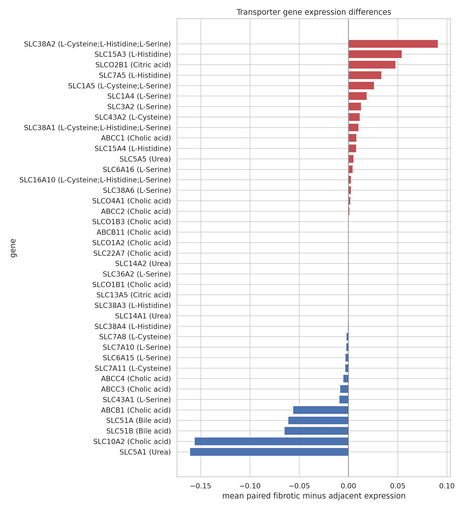

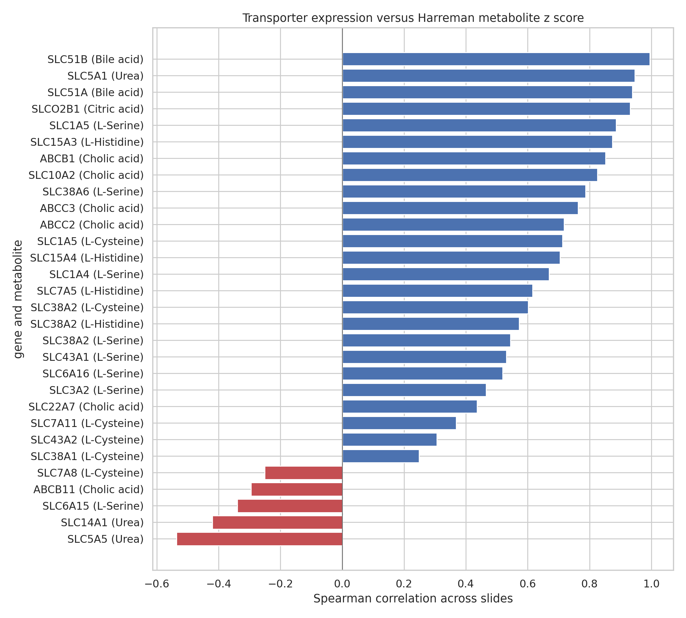

Representative all-slide transporter expression maps:


Detailed transporter validation outputs:

- `output/transporter_spatial_validation/transporter_spatial_validation_overview.json`
- `output/transporter_spatial_validation/focus_metabolite_transporter_gene_map.csv`
- `output/transporter_spatial_validation/transporter_gene_expression_by_sample.csv`
- `output/transporter_spatial_validation/paired_transporter_gene_expression_differences.csv`
- `output/transporter_spatial_validation/transporter_gene_difference_summary.csv`
- `output/transporter_spatial_validation/transporter_expression_harreman_correlations.csv`
- `output/transporter_spatial_validation/transporter_gene_difference_summary.png`
- `output/transporter_spatial_validation/transporter_expression_harreman_correlations.png`
- `output/transporter_spatial_validation/maps/`

### Spatial Region-Level Validation

The next validation step tested whether the transporter signals localize to plausible spatial regions within slides. High-signal regions were defined separately within each slide using the top 20% of a composite region score. This avoids allowing larger slides or globally higher-expression slides to dominate the region calls.

| Region | Composite inputs |
|---|---|
| Epithelial bile region | `Absorptive`, `Microfold`, bile-acid transport score, epithelial-repair score |
| Epithelial absorptive region | `Absorptive`, `Microfold`, epithelial-repair score |
| Stromal fibrotic region | `Fibroblast`, `Myofibroblast`, `Macrophage`, ECM-remodeling score, inflammation score |
| Immune inflammatory region | `Macrophage`, `Monocyte`, `B_plasma`, inflammation score |

| Metric | Value |
|---|---:|
| Spots analyzed | 58,815 |
| Slides analyzed | 20 |
| High-region fraction per slide | 20% |
| Focus transporter genes present | 12 |

Epithelial bile and absorptive regions were strongly enriched for the adjacent-shifted bile-acid and urea transporter genes. The largest enrichment was `SLC5A1`, followed by `SLC51A`, `SLC51B`, `SLC10A2`, `ABCB1`, and `ABCC3`.

| Region | Gene | Mean in region | Mean outside region | Difference |
|---|---|---:|---:|---:|
| Epithelial bile | `SLC5A1` | 1.310 | 0.324 | 0.987 |
| Epithelial bile | `SLC51A` | 0.399 | 0.044 | 0.355 |
| Epithelial bile | `SLC51B` | 0.357 | 0.039 | 0.318 |
| Epithelial bile | `SLC10A2` | 0.327 | 0.040 | 0.286 |
| Epithelial bile | `ABCB1` | 0.327 | 0.067 | 0.260 |
| Epithelial bile | `ABCC3` | 0.293 | 0.042 | 0.251 |

Stromal-fibrotic regions showed the opposite pattern for epithelial transporters and were enriched for the fibrotic amino-acid transporter signal. `SLC38A2` was higher in stromal-fibrotic regions than outside those regions, while `SLC5A1`, `SLC51A`, `SLC51B`, and `SLC10A2` were depleted.

| Region | Gene | Mean in region | Mean outside region | Difference |
|---|---|---:|---:|---:|
| Stromal fibrotic | `SLC38A2` | 0.841 | 0.677 | 0.164 |
| Stromal fibrotic | `SLCO2B1` | 0.455 | 0.353 | 0.101 |
| Stromal fibrotic | `SLC15A3` | 0.317 | 0.234 | 0.082 |
| Stromal fibrotic | `SLC1A5` | 0.219 | 0.160 | 0.059 |
| Stromal fibrotic | `SLC5A1` | 0.244 | 0.591 | -0.347 |
| Stromal fibrotic | `SLC51A` | 0.032 | 0.136 | -0.104 |

Paired patient comparisons within high-signal regions sharpened the disease contrast. In epithelial bile regions, fibrotic slides had lower `SLC5A1`, `SLC10A2`, `SLC51A`, and `SLC51B` expression than adjacent slides. In stromal-fibrotic regions, fibrotic slides had higher `SLC38A2`, `SLCO2B1`, and `SLC15A3` expression.

| Region | Gene | Mean fibrotic-minus-adjacent expression | Positive patient fraction |
|---|---|---:|---:|
| Epithelial bile | `SLC5A1` | -0.634 | 0.375 |
| Epithelial bile | `SLC10A2` | -0.507 | 0.250 |
| Epithelial bile | `SLC51A` | -0.240 | 0.250 |
| Epithelial bile | `SLC51B` | -0.236 | 0.250 |
| Stromal fibrotic | `SLC38A2` | 0.106 | 0.875 |
| Stromal fibrotic | `SLCO2B1` | 0.063 | 0.750 |
| Stromal fibrotic | `SLC15A3` | 0.063 | 0.625 |

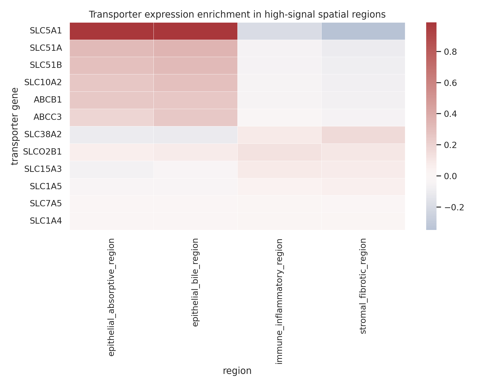

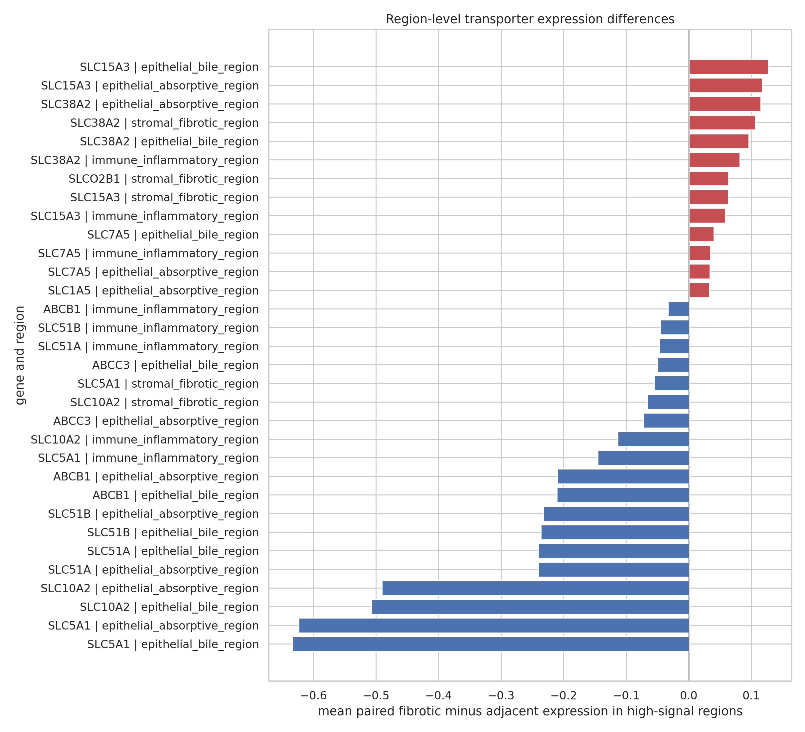

Representative all-slide spatial region maps:


Detailed spatial region validation outputs:

- `output/spatial_region_validation/spatial_region_validation_overview.json`
- `output/spatial_region_validation/spot_region_scores_selected.csv`
- `output/spatial_region_validation/region_score_summary_by_sample.csv`
- `output/spatial_region_validation/region_transporter_enrichment.csv`
- `output/spatial_region_validation/region_transporter_correlations.csv`
- `output/spatial_region_validation/region_transporter_expression_by_sample.csv`
- `output/spatial_region_validation/paired_region_transporter_differences.csv`
- `output/spatial_region_validation/paired_region_transporter_difference_summary.csv`
- `output/spatial_region_validation/region_transporter_enrichment_heatmap.png`
- `output/spatial_region_validation/paired_region_transporter_differences.png`
- `output/spatial_region_validation/maps/`

### scRNA-seq Cell-Type Metabolism And Transporters

The annotated scRNA-seq object was used directly to ask whether the spatial Harreman and deconvolution findings are consistent with cell-type-level expression patterns. The analysis computed the same nine curated metabolism gene-set scores used in spatial transcriptomics, plus Harreman-relevant transporter-gene expression and two focused transporter panels.

| Metric | Value |
|---|---:|
| scRNA-seq cells analyzed | 347,017 |
| scRNA-seq genes | 33,551 |
| Metabolism gene sets scored | 9 |
| Harreman-relevant transporter genes summarized | 41 |

The scRNA-seq reference supports the interpretation that adjacent-shifted bile-acid and urea transporter signals are epithelial and enterocyte-associated. Bile-acid transport and the epithelial bile/urea transporter panel were highest in enterocyte states.

| Feature | Top cell type | Fraction | Cells | Mean score |
|---|---|---|---:|---:|
| Bile-acid transport | Enterocytes-MT-hi | epi | 887 | 0.444 |
| Bile-acid transport | Enterocyte-FABP-hi | imu | 12,031 | 0.428 |
| Bile-acid transport | Enterocyte-FABP-hi | epi | 9,937 | 0.390 |
| Epithelial bile/urea transport | Enterocytes-MT-hi | epi | 887 | 0.422 |
| Epithelial bile/urea transport | Enterocyte-ANPEP-hi | imu | 22,210 | 0.317 |
| Epithelial bile/urea transport | Enterocyte-ANPEP-hi | epi | 26,837 | 0.313 |

The fibrotic amino-acid transporter panel was strongest in macrophage-like and inflammatory populations, with inflammatory fibroblasts also ranking in the top cell types. This is consistent with the spatial-region result that `SLC38A2`, `SLC15A3`, `SLCO2B1`, and related genes are enriched outside epithelial bile regions and increase in fibrotic or stromal-fibrotic contexts.

| Feature | Top cell type | Fraction | Cells | Mean score |
|---|---|---|---:|---:|
| Fibrotic amino-acid transport | M2-like macrophage-A2M-hi | imu | 550 | 0.271 |
| Fibrotic amino-acid transport | M2-like macrophage | imu | 1,716 | 0.211 |
| Fibrotic amino-acid transport | CD63+CD81+ macrophage | imu | 1,419 | 0.171 |
| Fibrotic amino-acid transport | Monocyte-HSP-hi | imu | 391 | 0.171 |
| Fibrotic amino-acid transport | Inflammatory fibroblasts | imu | 1,347 | 0.134 |

The scRNA-seq metabolism scores also recover expected stromal and inflammatory biology. ECM remodeling was highest in trophocyte, telocyte, myofibroblast, pericyte, and fibroblast populations. Inflammation was highest in neutrophils, monocytes, and macrophage-like states.

| Feature | Top cell type | Fraction | Cells | Mean score |
|---|---|---|---:|---:|
| ECM remodeling | Trophocyte-TGFBI hi | imu | 854 | 1.033 |
| ECM remodeling | Telocyte | imu | 1,117 | 0.988 |
| ECM remodeling | Myofibroblasts | imu | 643 | 0.960 |
| ECM remodeling | Pericytes | imu | 481 | 0.815 |
| Inflammation | Neutrophils | epi | 666 | 1.419 |
| Inflammation | Neutrophils | imu | 3,259 | 1.383 |
| Inflammation | Monocyte-HSP-hi | imu | 391 | 0.926 |
| Inflammation | Monocyte | imu | 2,119 | 0.826 |

Status contrasts in the scRNA-seq object are not a substitute for a patient-paired spatial model, but they add useful support. Inflammatory fibroblasts had a strong fibrotic-minus-normal increase in ECM remodeling, and macrophage-like states showed fibrotic increases in the amino-acid transporter panel.

| Cell type | Feature | Fibrotic-minus-normal |
|---|---|---:|
| Inflammatory fibroblasts | ECM remodeling | 0.656 |
| Myofibroblasts | ECM remodeling | 0.145 |
| M2-like macrophage | Fibrotic amino-acid transport | 0.107 |
| Tissue macrophage | Inflammation | 0.079 |
| Inflammatory fibroblasts | Inflammation | 0.073 |

Together, the scRNA-seq results support a two-part interpretation of the spatial metabolism results. First, adjacent-shifted bile-acid, cholic-acid, and urea-associated signals are likely driven by enterocyte-rich epithelial regions. Second, fibrotic-shifted amino-acid transporter signals are more consistent with macrophage, inflammatory fibroblast, and stromal-fibrotic regions than with absorptive epithelium alone.

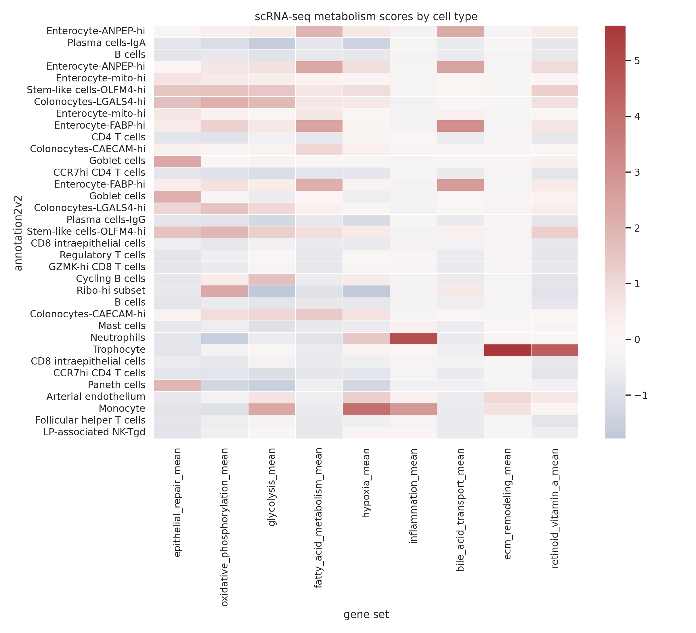

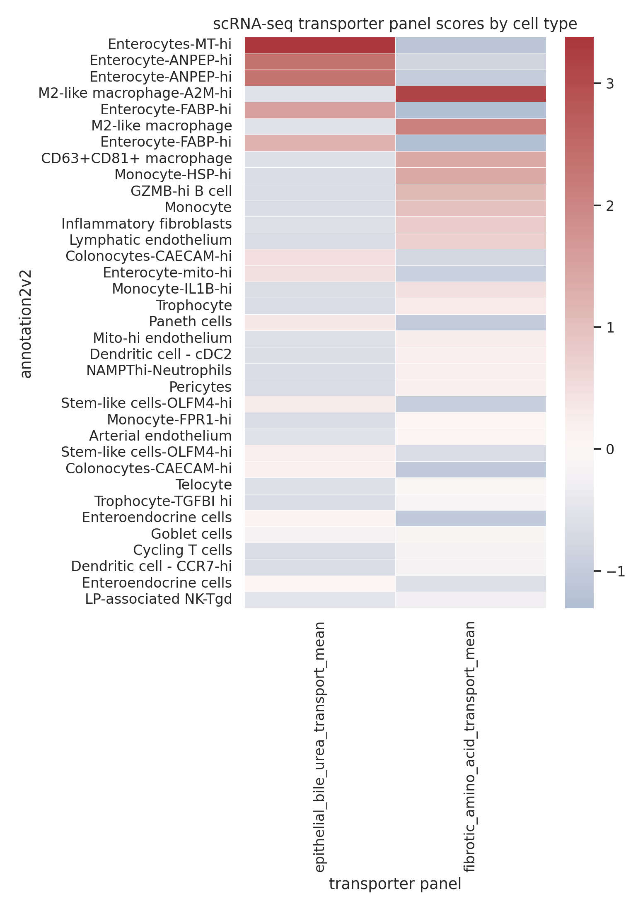

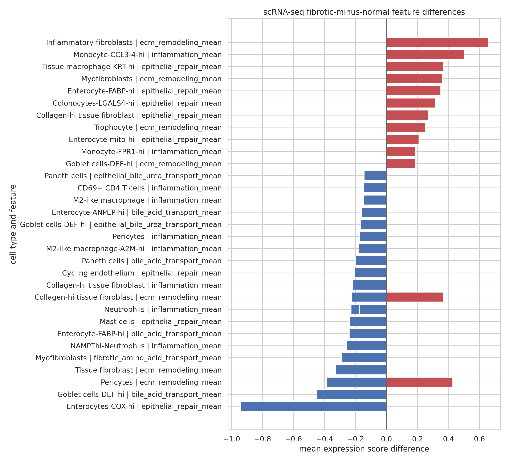

Detailed scRNA-seq metabolism and transporter outputs:

- `output/scrna_metabolism_transporters/scrna_metabolism_transporters_overview.json`
- `output/scrna_metabolism_transporters/scrna_cell_type_feature_summary.csv`
- `output/scrna_metabolism_transporters/scrna_cell_type_status_feature_summary.csv`
- `output/scrna_metabolism_transporters/scrna_donor_cell_type_feature_summary.csv`
- `output/scrna_metabolism_transporters/scrna_transporter_expression_by_cell_type_status.csv`
- `output/scrna_metabolism_transporters/scrna_status_feature_differences.csv`
- `output/scrna_metabolism_transporters/scrna_top_cell_types_by_feature.csv`
- `output/scrna_metabolism_transporters/scrna_feature_gene_membership.csv`
- `output/scrna_metabolism_transporters/scrna_metabolism_by_cell_type_heatmap.png`
- `output/scrna_metabolism_transporters/scrna_transporter_panels_by_cell_type_heatmap.png`
- `output/scrna_metabolism_transporters/scrna_status_feature_differences.png`

### Integrated Evidence Table

The current analysis layers were integrated into a metabolite-level evidence table. This table is intended as a prioritization artifact for manuscript-style interpretation and for deciding which signals merit heavier statistical modeling.

| Metabolite | Harreman direction | Main supporting evidence | Working interpretation |
|---|---|---|---|
| Bile acid | Adjacent-shifted | `SLC51B` and `SLC51A` correlate strongly with Harreman scores; epithelial bile regions are enriched for both genes and lower in fibrotic paired regions; Harreman scores correlate with microfold and absorptive deconvolution | Enterocyte and epithelial bile-acid transport signal reduced in fibrotic slides |
| Cholic acid | Adjacent-shifted | `SLC10A2`, `ABCB1`, `ABCC3`, and `ABCC2` correlate with Harreman scores; `SLC10A2` is strongly enriched in epithelial bile regions and lower in fibrotic paired regions | Ileal/epithelial bile-acid transporter program reduced in fibrotic slides |
| Urea | Adjacent-shifted | `SLC5A1` correlates with Harreman score, is strongly enriched in epithelial bile and absorptive regions, and is lower in fibrotic paired regions | Epithelial absorptive transporter signal reduced in fibrotic slides |
| L-histidine | Fibrotic-shifted | `SLC15A3`, `SLC7A5`, and `SLC38A2` support Harreman scores; scRNA-seq amino-acid transporter panel is highest in macrophage-like states | Fibrotic amino-acid transporter signal associated with macrophage and stromal/inflammatory regions |
| L-serine | Fibrotic-shifted | `SLC1A5`, `SLC38A6`, `SLC1A4`, and `SLC38A2` correlate with Harreman scores; `SLC38A2` is enriched in stromal-fibrotic regions and higher in paired fibrotic regions | Fibrotic amino-acid transporter signal linked to stromal-fibrotic and macrophage-associated regions |
| Citric acid | Fibrotic-shifted | `SLCO2B1` strongly correlates with Harreman score; `SLCO2B1` is enriched in immune-inflammatory and stromal-fibrotic regions and higher in paired fibrotic regions | Organic-anion transporter signal associated with fibrotic inflammatory regions |
| L-cysteine | Fibrotic-shifted | `SLC1A5`, `SLC38A2`, and `SLC7A11` support Harreman scores; scRNA-seq amino-acid transporter panel is highest in macrophage-like states | Fibrotic amino-acid transporter signal associated with macrophage and stromal-fibrotic biology |

Full integrated evidence outputs:

- `output/integrated_evidence/integrated_evidence_overview.json`
- `output/integrated_evidence/integrated_metabolite_evidence.csv`
- `output/integrated_evidence/integrated_metabolite_evidence.md`

### Patient-Paired Modeling

Patient-paired modeling was run across Harreman metabolites, slide-level transporter expression, region-level transporter expression, spatial metabolism scores, and deconvolved cell-type proportions. Each test used the patient-level fibrotic-minus-adjacent difference as the observation. This keeps the patient as the statistical unit and avoids treating spots as independent samples.

| Metric | Value |
|---|---:|
| Patient-feature paired rows | 2,720 |
| Modeled features | 355 |
| Priority features | 45 |
| Features passing paired t-test FDR < 0.10 and Wilcoxon FDR < 0.10 | 0 |

No tested feature survived layer-wise FDR correction at 0.10 by both paired t-test and Wilcoxon test. With only 5 to 8 paired patients per feature, this means the paired models should be read as effect-size and consistency summaries rather than confirmatory statistical evidence.

Among priority features, the largest paired effect sizes supported the integrated interpretation. `SLC38A2` was higher in fibrotic stromal-fibrotic regions, `SLC10A2` was lower in fibrotic epithelial regions, `SLC15A3` was higher in fibrotic stromal-fibrotic regions, and `B_plasma` deconvolution was higher in fibrotic slides. Several bootstrap confidence intervals for the mean difference did not cross zero, but the corresponding FDR values remained above 0.10.

| Layer | Feature | Mean fibrotic-minus-adjacent | Cohen dz | Paired t p | Paired t FDR | Direction |
|---|---|---:|---:|---:|---:|---|
| Region transporter | Stromal fibrotic `SLC38A2` | 0.106 | 0.912 | 0.037 | 0.421 | Fibrotic higher |
| Deconvolution | `B_plasma` | 0.164 | 0.813 | 0.055 | 0.318 | Fibrotic higher |
| Region transporter | Epithelial bile `SLC10A2` | -0.507 | -0.777 | 0.064 | 0.421 | Adjacent higher |
| Region transporter | Stromal fibrotic `SLC15A3` | 0.063 | 0.776 | 0.064 | 0.421 | Fibrotic higher |
| Region transporter | Epithelial absorptive `SLC10A2` | -0.491 | -0.772 | 0.065 | 0.421 | Adjacent higher |
| Slide transporter | `SLC10A2` | -0.156 | -0.763 | 0.068 | 0.611 | Adjacent higher |
| Slide transporter | `SLCO2B1` | 0.048 | 0.757 | 0.070 | 0.611 | Fibrotic higher |
| Slide transporter | `SLC15A3` | 0.054 | 0.740 | 0.075 | 0.611 | Fibrotic higher |
| Harreman | Citric acid | 4.939 | 0.731 | 0.078 | 0.597 | Fibrotic higher |
| Spatial metabolism score | Bile-acid transport | -0.530 | -0.669 | 0.100 | 0.581 | Adjacent higher |

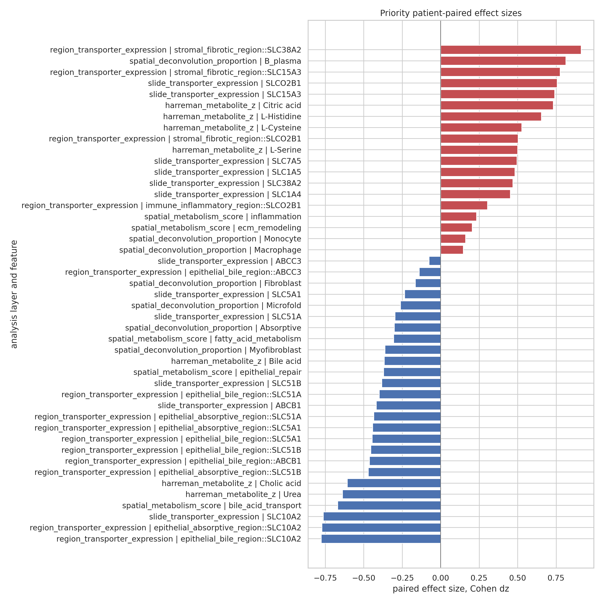

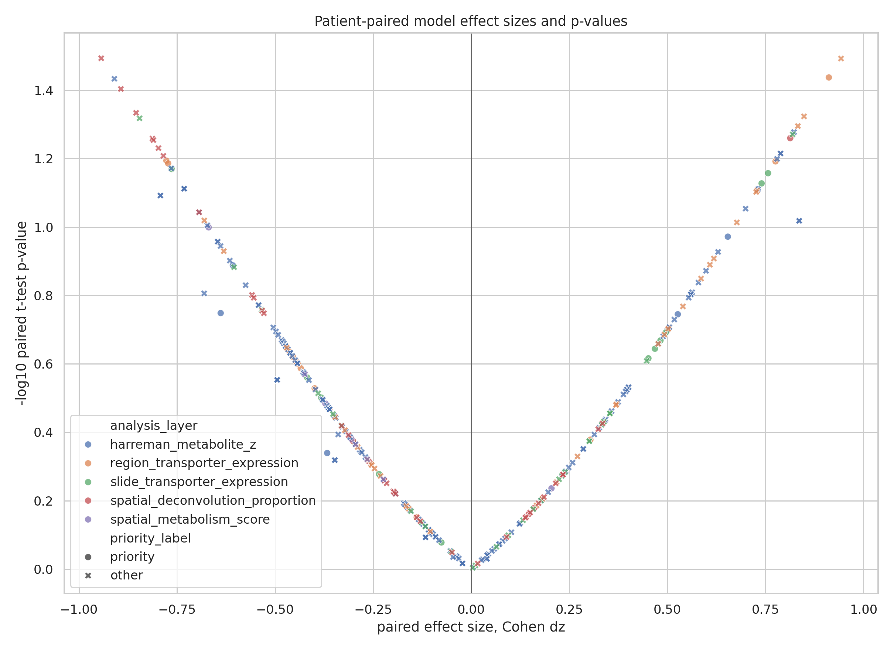

Detailed patient-paired modeling outputs:

- `output/patient_paired_models/patient_paired_models_overview.json`
- `output/patient_paired_models/paired_model_input_long.csv`
- `output/patient_paired_models/patient_paired_model_results.csv`
- `output/patient_paired_models/priority_patient_paired_model_results.csv`
- `output/patient_paired_models/fdr_supported_patient_paired_model_results.csv`
- `output/patient_paired_models/priority_patient_paired_effect_sizes.png`
- `output/patient_paired_models/patient_paired_model_volcano.png`

### Region-Threshold Sensitivity

The region-level transporter results were tested against alternative high-region thresholds. The primary region analysis used the top 20% of spots per slide. Sensitivity analysis repeated the paired region-level transporter summaries using the top 10%, 20%, and 30% of spots per slide.

All 14 priority region-gene pairs preserved the same mean disease-direction sign across the three thresholds. This does not solve the small-patient-count limitation, but it reduces concern that the region-level conclusions are an artifact of the top-20% threshold.

| Region | Gene | Mean difference across thresholds | Min difference | Max difference | Stable sign |
|---|---|---:|---:|---:|---|
| Epithelial bile | `SLC5A1` | -0.655 | -0.863 | -0.470 | Yes |
| Epithelial absorptive | `SLC5A1` | -0.655 | -0.874 | -0.466 | Yes |
| Epithelial bile | `SLC10A2` | -0.526 | -0.672 | -0.400 | Yes |
| Epithelial absorptive | `SLC10A2` | -0.508 | -0.647 | -0.388 | Yes |
| Epithelial bile | `SLC51A` | -0.267 | -0.377 | -0.182 | Yes |
| Epithelial bile | `SLC51B` | -0.252 | -0.342 | -0.177 | Yes |
| Stromal fibrotic | `SLC38A2` | 0.086 | 0.041 | 0.112 | Yes |
| Stromal fibrotic | `SLCO2B1` | 0.067 | 0.063 | 0.070 | Yes |
| Stromal fibrotic | `SLC15A3` | 0.058 | 0.050 | 0.063 | Yes |
| Immune inflammatory | `SLCO2B1` | 0.045 | 0.031 | 0.069 | Yes |

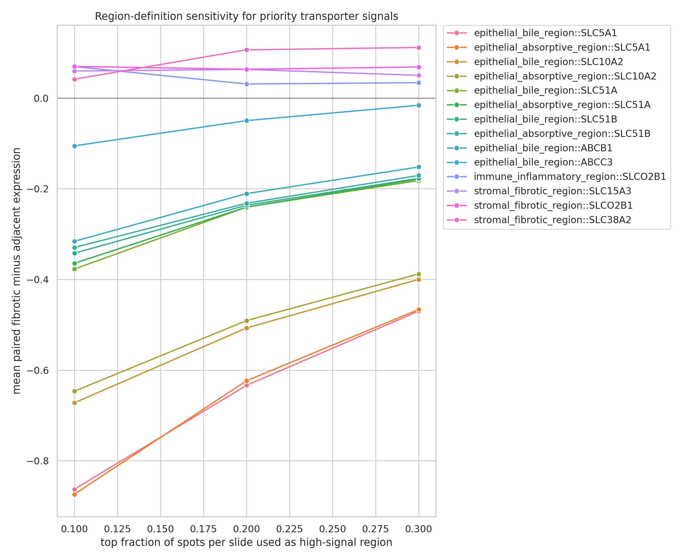

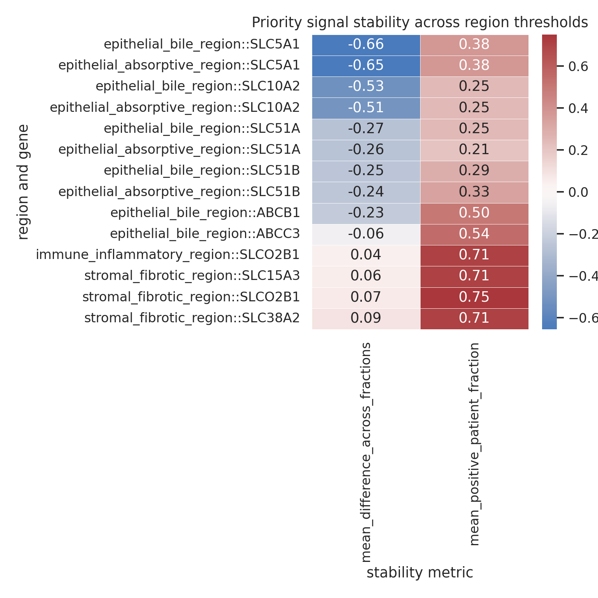

Detailed region-threshold sensitivity outputs:

- `output/region_sensitivity/region_sensitivity_overview.json`
- `output/region_sensitivity/region_threshold_enrichment_sensitivity.csv`
- `output/region_sensitivity/region_threshold_expression_by_sample.csv`
- `output/region_sensitivity/region_threshold_paired_differences.csv`
- `output/region_sensitivity/region_threshold_paired_difference_summary.csv`
- `output/region_sensitivity/priority_region_signal_stability.csv`
- `output/region_sensitivity/priority_region_threshold_sensitivity.png`
- `output/region_sensitivity/priority_region_signal_stability.png`

### Deconvolution Sensitivity

The CIBERSORTx NNLS deconvolution was compared with independent marker-gene scores for expected cell-type pairs. At slide level, marker scores correlated strongly with the corresponding deconvolved proportions for several major cell types. This supports using the deconvolution for broad epithelial, B/plasma, macrophage, fibroblast, and myofibroblast interpretation, while keeping the high NNLS residual in mind.

| Marker set | Deconvolved cell type | Slide-level Spearman rho |
|---|---|---:|
| B/plasma | `B_plasma` | 0.980 |
| Absorptive | `Absorptive` | 0.929 |
| Secretory | `Secretory` | 0.893 |
| B cells | `Mature_B` | 0.869 |
| Macrophage | `Macrophage` | 0.780 |
| Fibroblast | `Fibroblast` | 0.761 |
| Myofibroblast | `Myofibroblast` | 0.514 |
| Pericyte | `Pericyte` | 0.507 |
| Endothelial | `Vascular_endothelia` | 0.405 |

At the paired disease-difference level, 6 of 9 expected marker-to-deconvolution pairs had the same mean fibrotic-minus-adjacent direction. The strongest agreement was for B/plasma, B cells, absorptive, secretory, macrophage, and pericyte signals. Fibroblast, myofibroblast, and vascular endothelial marker scores had positive mean fibrotic-minus-adjacent differences, while their NNLS proportions had slightly negative mean differences. This suggests that stromal disease-direction interpretation should lean more on marker scores, region scores, and transporter evidence than on NNLS proportions alone.

| Marker set | Deconvolved cell type | Marker mean F-A | NNLS mean F-A | Same direction | Paired-difference rho |
|---|---|---:|---:|---|---:|
| B/plasma | `B_plasma` | 0.816 | 0.164 | Yes | 0.976 |
| B cells | `Mature_B` | 0.189 | 0.002 | Yes | 0.952 |
| Absorptive | `Absorptive` | -0.204 | -0.046 | Yes | 0.857 |
| Secretory | `Secretory` | -0.215 | -0.028 | Yes | 0.952 |
| Fibroblast | `Fibroblast` | 0.138 | -0.010 | No | 0.810 |
| Myofibroblast | `Myofibroblast` | 0.082 | -0.033 | No | 0.810 |
| Macrophage | `Macrophage` | 0.147 | 0.003 | Yes | 0.881 |
| Endothelial | `Vascular_endothelia` | 0.070 | -0.007 | No | 0.857 |
| Pericyte | `Pericyte` | -0.007 | -0.004 | Yes | 0.310 |

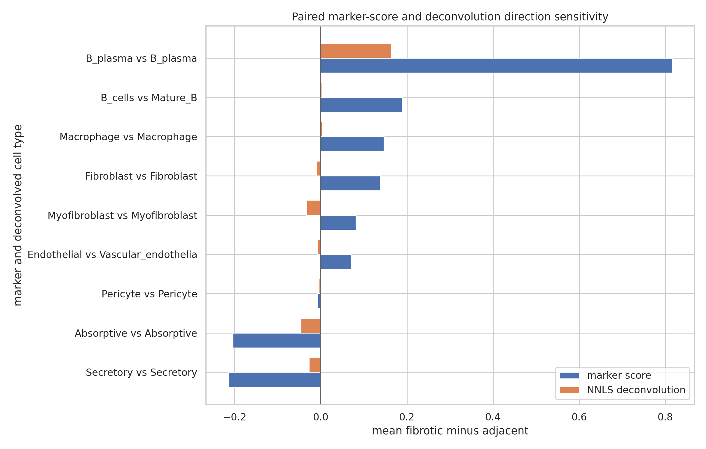

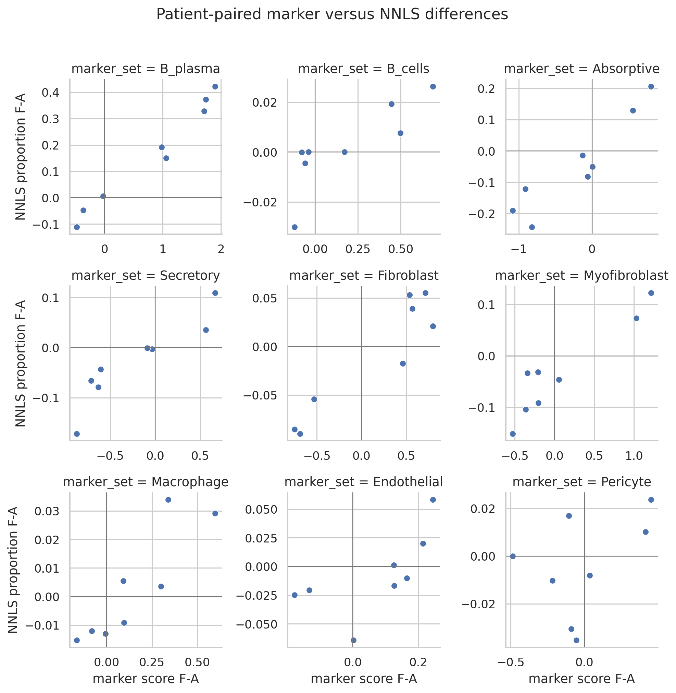

Detailed deconvolution sensitivity outputs:

- `output/deconvolution_sensitivity/deconvolution_sensitivity_overview.json`
- `output/deconvolution_sensitivity/paired_marker_score_differences.csv`
- `output/deconvolution_sensitivity/marker_deconvolution_paired_sensitivity.csv`
- `output/deconvolution_sensitivity/marker_deconvolution_patient_long.csv`
- `output/deconvolution_sensitivity/expected_marker_deconvolution_slide_correlations.csv`
- `output/deconvolution_sensitivity/marker_deconvolution_paired_direction.png`
- `output/deconvolution_sensitivity/marker_deconvolution_patient_scatter.png`

### Healthy-Control Comparisons

Healthy-control comparisons were added before manuscript-style interpretation. In the scRNA-seq object, healthy controls are represented by `status == "H"` across 10 donors. In spatial transcriptomics, the available disease-control reference is limited to two `Adjacent (Disease Control)` slides, so spatial results are descriptive and should not be treated as a formal differential test.

| Data layer | Healthy or control reference | Comparator groups |
|---|---|---|
| scRNA-seq | `H` status donors | `N`, `F`, and `I` status donors |
| Spatial transcriptomics | `Adjacent (Disease Control)` slides, n = 2 | Crohn's adjacent slides, n = 8; fibrotic slides, n = 10 |

In scRNA-seq, the largest healthy-control contrasts among priority cell types were stromal and epithelial. Fibrotic inflammatory fibroblasts and myofibroblasts had higher ECM remodeling scores than healthy controls. Enterocyte-FABP-hi and Enterocyte-ANPEP-hi cells had lower bile-acid transport scores in fibrotic samples than healthy controls, consistent with the spatial epithelial bile-acid transporter axis. Some fibroblast comparisons include only two healthy-control donors and should be interpreted cautiously.

| Cell type | Feature | Comparison | Difference versus healthy |
|---|---|---|---:|
| Inflammatory fibroblasts | ECM remodeling | F minus H | 0.714 |
| Myofibroblasts | ECM remodeling | F minus H | 0.381 |
| Enterocyte-FABP-hi | Bile-acid transport | F minus H | -0.213 |
| Enterocyte-ANPEP-hi | Bile-acid transport | F minus H | -0.105 |
| Inflammatory fibroblasts | Inflammation | F minus H | 0.141 |

In spatial transcriptomics, disease-control adjacent slides had the highest epithelial bile/urea transporter signal. Fibrotic slides were lower than disease-control slides for epithelial-bile-region `SLC5A1`, epithelial-bile-region `SLC10A2`, bile-acid transport score, slide-level `SLC5A1`, epithelial-bile-region `SLC51A`, and epithelial-bile-region `SLC51B`. Fibrotic slides were higher than disease-control slides for inflammation, ECM remodeling, B/plasma deconvolution, stromal-fibrotic-region `SLC15A3`, and stromal-fibrotic-region `SLCO2B1`.

| Layer | Feature | Comparison | Difference versus disease control |
|---|---|---|---:|
| Region transporter | Epithelial bile `SLC5A1` | Fibrotic minus disease control | -1.400 |
| Region transporter | Epithelial bile `SLC10A2` | Fibrotic minus disease control | -1.129 |
| Spatial metabolism | Bile-acid transport | Fibrotic minus disease control | -0.834 |
| Spatial metabolism | Inflammation | Fibrotic minus disease control | 0.568 |
| Slide transporter | `SLC5A1` | Fibrotic minus disease control | -0.522 |
| Region transporter | Epithelial bile `SLC51A` | Fibrotic minus disease control | -0.447 |
| Spatial metabolism | ECM remodeling | Fibrotic minus disease control | 0.414 |
| Spatial deconvolution | `B_plasma` | Fibrotic minus disease control | 0.297 |
| Region transporter | Stromal fibrotic `SLC15A3` | Fibrotic minus disease control | 0.235 |

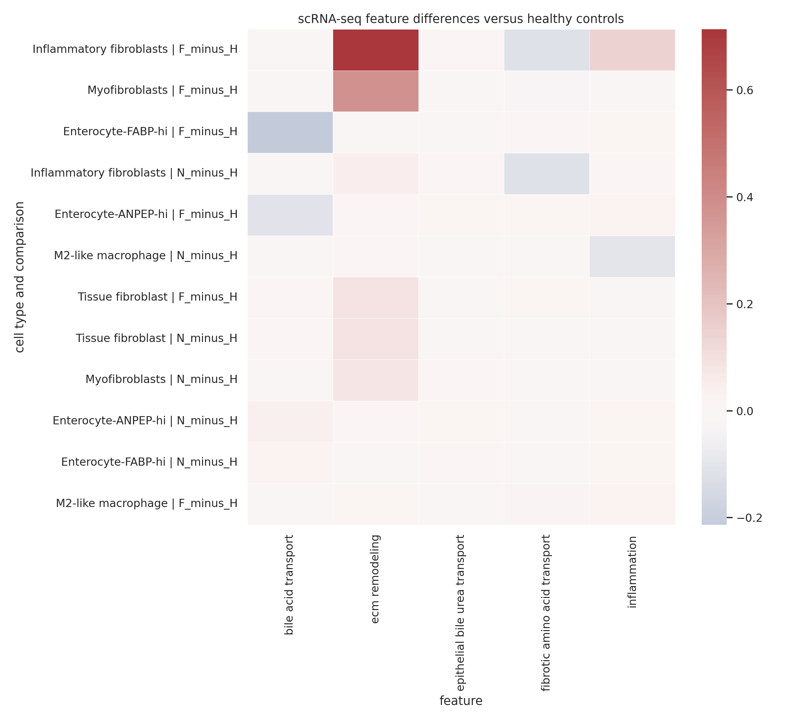

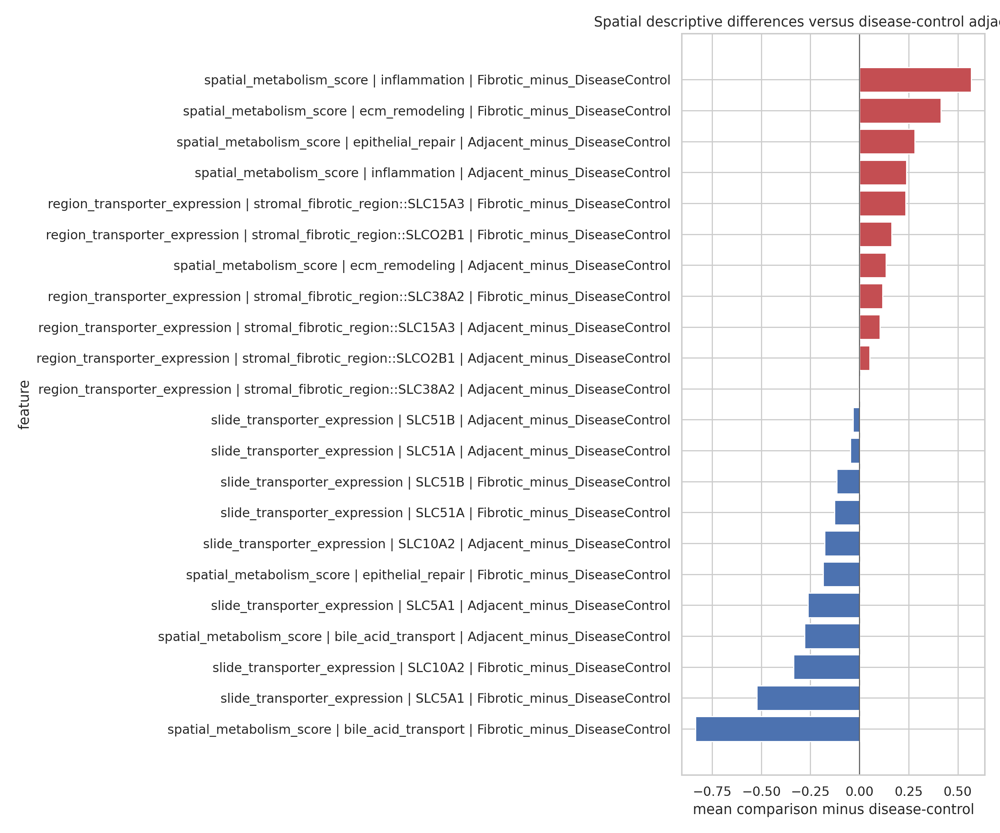

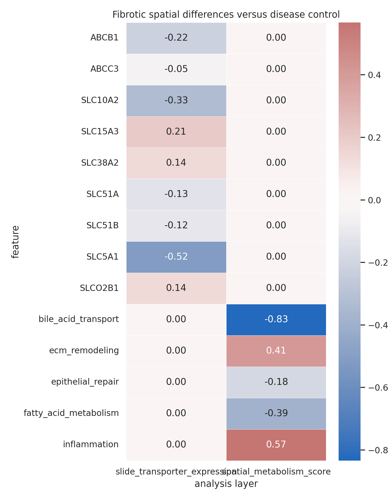

Detailed healthy-control comparison outputs:

- `output/healthy_control_comparisons/healthy_control_comparisons_overview.json`
- `output/healthy_control_comparisons/scrna_healthy_status_comparisons.csv`
- `output/healthy_control_comparisons/spatial_disease_control_comparisons.csv`
- `output/healthy_control_comparisons/spatial_disease_control_sample_counts.csv`
- `output/healthy_control_comparisons/scrna_healthy_status_comparison_heatmap.png`
- `output/healthy_control_comparisons/spatial_disease_control_difference_bars.png`
- `output/healthy_control_comparisons/spatial_fibrotic_vs_disease_control_heatmap.png`

### Consolidated Figures

The strongest evidence layers were consolidated into report-ready figures. The main panel separates four pieces of evidence: Harreman metabolite direction, region-threshold-stable transporter signals, scRNA-seq cell-type support, and marker-versus-deconvolution sensitivity. A separate healthy-control panel integrates scRNA-seq healthy donor comparisons and spatial disease-control slide comparisons. The schematic summarizes the current interpretation and caveats.

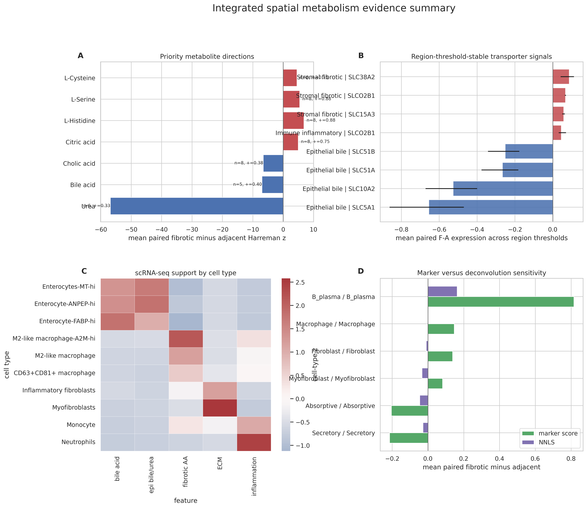

**Figure 1. Integrated evidence summary for spatial metabolism programs in stricturing Crohn's disease.** Panel A shows mean paired fibrotic-minus-adjacent Harreman z-score differences for priority metabolites. Negative values indicate adjacent-shifted metabolites, while positive values indicate fibrotic-shifted metabolites. Panel B shows region-threshold-stable transporter-gene differences across high-signal region definitions using the top 10%, 20%, and 30% of spots per slide. Panel C summarizes scRNA-seq cell-type support for epithelial bile/urea, fibrotic amino-acid, ECM, and inflammatory programs. Panel D compares marker-score and NNLS deconvolution paired disease-direction estimates for expected cell-type pairs. The figure highlights a robust adjacent-shifted epithelial bile-acid and urea transporter axis, and a more cautious fibrotic amino-acid and organic-anion transporter axis.

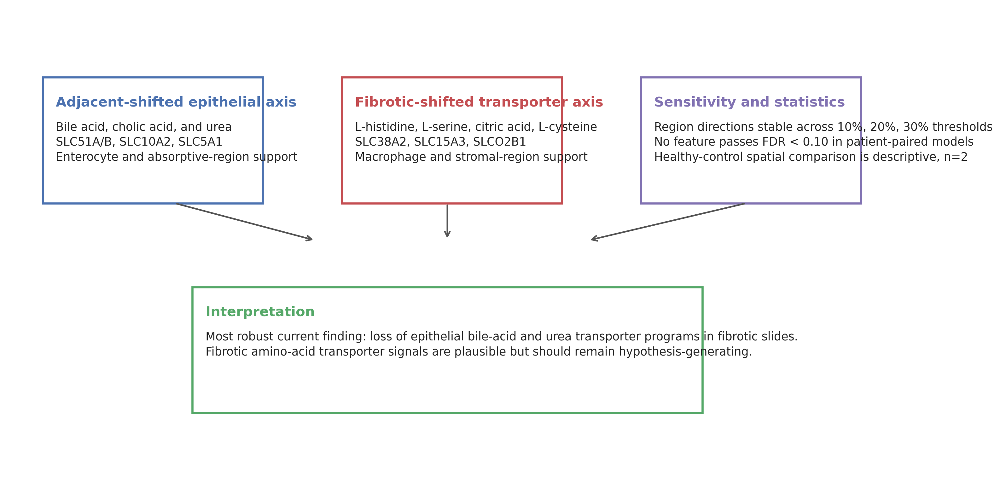

**Figure 2. Working interpretation of metabolism-associated spatial programs.** The schematic separates the evidence into an adjacent-shifted epithelial transporter axis, a fibrotic-shifted transporter axis, and sensitivity/statistical constraints. The epithelial axis is supported by Harreman direction, transporter expression, epithelial spatial regions, scRNA-seq enterocyte expression, and marker/deconvolution concordance. The fibrotic transporter axis is supported by transporter expression, stromal or inflammatory regions, and scRNA-seq macrophage/stromal expression, but remains hypothesis-generating because paired statistical tests did not survive FDR correction and stromal deconvolution direction is marker-sensitive.

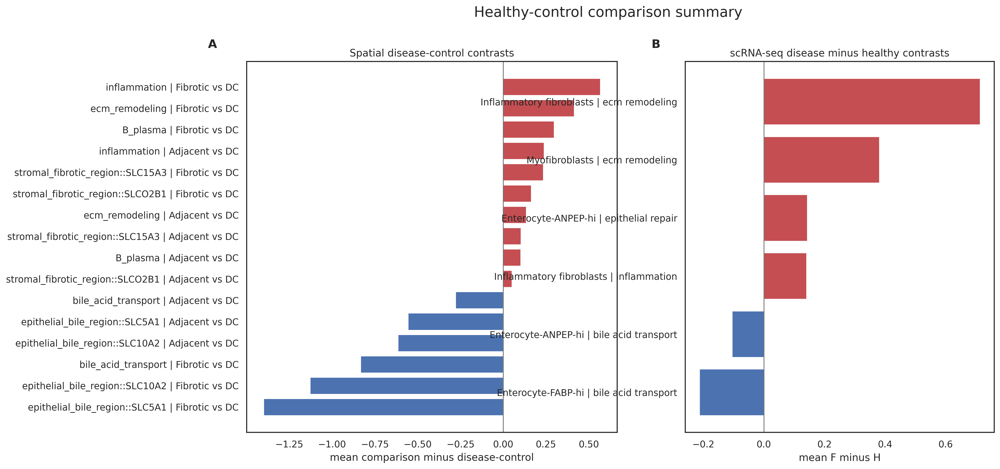

**Figure 3. Healthy-control and disease-control comparisons.** Panel A summarizes spatial descriptive contrasts using the two `Adjacent (Disease Control)` slides as a disease-control reference. Fibrotic slides show lower epithelial bile/urea transporter signals and higher inflammatory or stromal-associated signals relative to disease-control slides. Panel B summarizes scRNA-seq disease-minus-healthy contrasts using `H` status donors as the healthy reference. Fibrotic inflammatory fibroblasts and myofibroblasts show higher ECM remodeling than healthy controls, while fibrotic enterocyte states show lower bile-acid transport. Spatial disease-control comparisons are descriptive because only two disease-control slides are available.

The consolidated summary reinforces two working axes:

- adjacent-shifted epithelial axis: urea, bile acid, and cholic acid, supported by `SLC5A1`, `SLC10A2`, `SLC51A`, `SLC51B`, enterocyte scRNA-seq expression, and epithelial/absorptive spatial regions;
- fibrotic-shifted transporter axis: citric acid, L-histidine, L-serine, and L-cysteine, supported by `SLC38A2`, `SLC15A3`, `SLCO2B1`, macrophage or stromal scRNA-seq expression, and stromal-fibrotic or immune-inflammatory spatial regions.

The first axis is currently more robust because epithelial deconvolution, marker scores, region sensitivity, transporter expression, and scRNA-seq support point in the same direction. The second axis is plausible but should remain more cautious because stromal NNLS deconvolution direction is less stable against marker-score sensitivity.

Detailed consolidated figure outputs:

- `output/consolidated_figures/consolidated_figures_overview.json`
- `output/consolidated_figures/consolidated_priority_signal_summary.csv`
- `output/consolidated_figures/integrated_evidence_summary_panel.png`
- `output/consolidated_figures/integrated_interpretation_schematic.png`
- `output/consolidated_figures/healthy_control_summary_panel.png`

### Manuscript-Style Results Draft

#### Spatial metabolism inference identifies loss of epithelial bile-acid and urea transporter programs in fibrotic tissue

Across paired adjacent and fibrotic spatial transcriptomics slides, Harreman prioritized a set of epithelial-associated metabolites that were lower in fibrotic tissue. Urea, bile acid, and cholic acid showed negative mean fibrotic-minus-adjacent Harreman z-score differences. These signals were supported by transporter-level evidence. `SLC5A1`, which was linked to the urea signal in the Harreman transporter database, correlated strongly with slide-level Harreman urea scores and was enriched in epithelial bile and absorptive regions. `SLC10A2`, `SLC51A`, and `SLC51B` supported the cholic-acid and bile-acid signals and were likewise enriched in epithelial regions.

The epithelial interpretation was consistent across analysis layers. Harreman bile-acid, cholic-acid, and urea scores correlated with absorptive and microfold deconvolution estimates. Independent marker-gene sensitivity supported the absorptive epithelial direction: absorptive marker scores and NNLS absorptive deconvolution both decreased in fibrotic-minus-adjacent comparisons. The scRNA-seq reference also supported this assignment, with bile-acid transport and epithelial bile/urea transporter scores highest in enterocyte states.

Healthy-control comparisons strengthened this epithelial axis. In scRNA-seq, fibrotic Enterocyte-FABP-hi and Enterocyte-ANPEP-hi states had lower bile-acid transport scores than healthy-control cells. In spatial transcriptomics, the two disease-control adjacent slides had higher epithelial bile/urea transporter signals than Crohn's adjacent and fibrotic slides. Fibrotic slides showed lower epithelial-bile-region `SLC5A1`, epithelial-bile-region `SLC10A2`, bile-acid transport score, slide-level `SLC5A1`, epithelial-bile-region `SLC51A`, and epithelial-bile-region `SLC51B` than disease-control slides. Because the spatial disease-control group contains only two slides, these comparisons should be interpreted as descriptive rather than confirmatory.

#### Fibrotic tissue shows a candidate amino-acid and organic-anion transporter program associated with inflammatory and stromal regions

Harreman also identified fibrotic-shifted metabolites, including L-histidine, L-serine, L-cysteine, and citric acid. These signals were supported by transporter genes including `SLC38A2`, `SLC15A3`, `SLC1A5`, `SLC7A5`, and `SLCO2B1`. Region-level analysis showed that `SLC38A2`, `SLC15A3`, and `SLCO2B1` were higher in stromal-fibrotic or immune-inflammatory regions than in epithelial bile regions. The direction of these region-level transporter signals was stable across high-region definitions using the top 10%, 20%, and 30% of spots per slide.

The scRNA-seq reference assigned this transporter program primarily to macrophage-like and stromal-associated populations. The fibrotic amino-acid transporter panel was highest in M2-like macrophage, CD63+CD81+ macrophage, monocyte, and inflammatory fibroblast populations. ECM remodeling scores were highest in trophocyte, telocyte, myofibroblast, pericyte, tissue fibroblast, and inflammatory fibroblast populations. Compared with healthy-control cells, fibrotic inflammatory fibroblasts and myofibroblasts showed higher ECM remodeling scores.

This fibrotic transporter axis should be interpreted more cautiously than the epithelial axis. Patient-paired models did not identify FDR-supported features at 0.10 across the tested analysis layers. In addition, paired marker-score and NNLS deconvolution directions disagreed for fibroblast, myofibroblast, and vascular endothelial signals. For this reason, stromal and fibrotic interpretations should rely on convergent transporter, region-score, marker-score, and scRNA-seq evidence rather than NNLS deconvolution alone.

#### Patient-level modeling supports effect-size prioritization but not confirmatory differential claims

Patient-paired statistical modeling treated each fibrotic-minus-adjacent difference as one observation. Across 355 modeled features and 45 priority features, no feature passed both paired t-test FDR < 0.10 and Wilcoxon FDR < 0.10. The strongest priority effect-size summaries nevertheless matched the cross-layer interpretation: stromal-fibrotic-region `SLC38A2` was higher in fibrotic tissue, epithelial-region `SLC10A2` was lower in fibrotic tissue, stromal-fibrotic-region `SLC15A3` was higher in fibrotic tissue, slide-level `SLC10A2` was lower in fibrotic tissue, slide-level `SLCO2B1` and `SLC15A3` were higher in fibrotic tissue, Harreman citric acid was higher in fibrotic tissue, and spatial bile-acid transport was lower in fibrotic tissue.

Together, the current results support two metabolism-associated spatial programs. The strongest is an epithelial bile-acid and urea transporter program that is reduced in fibrotic Crohn's tissue and lower than the limited disease-control spatial reference. The second is a candidate fibrotic amino-acid and organic-anion transporter program associated with macrophage-like, inflammatory, and stromal-fibrotic contexts. The latter remains hypothesis-generating and requires stronger validation before being interpreted as a confirmed disease-associated metabolic program.

## Next Analyses

The next step is interpretation and refinement rather than another broad method run. Priority analyses are:

- compare Harreman results with the simpler gene-set scores;
- compare Harreman results with the CIBERSORTx signature-matrix deconvolution;
- refine deconvolution using marker-gene diagnostics, alternative gene selection, or a heavier method if needed;
- convert the consolidated figures and evidence tables into manuscript-style results text.

The immediate next refinement should be manuscript-style results text and figure captions. The analyses now identify a robust epithelial bile-acid and urea transporter axis that is also lower relative to spatial disease-control slides, plus a more cautious fibrotic amino-acid and organic-anion transporter axis that needs stronger validation before being treated as confirmatory.

## Limitations

Current results include inventory, metadata-level summaries, spatial coordinate/image QC, exploratory metabolism/fibrosis gene-set scores, one Harreman pilot, an all-paired-slide Harreman transporter communication run, first-pass CIBERSORTx signature-matrix deconvolution, an initial Harreman-cell-type interpretation layer, focused transporter-gene spatial validation, region-level validation, direct scRNA-seq cell-type metabolism and transporter summaries, an integrated metabolite evidence table, patient-paired statistical modeling, region-threshold sensitivity analysis, deconvolution marker sensitivity analysis, healthy-control comparisons, and consolidated summary figures. No cell-type-aware Harreman model has been generated yet. The patient-paired models did not identify FDR-supported features at 0.10, so the current effect-size results remain hypothesis-generating. Transporter expression supports several Harreman signals, but expression is not a direct measure of metabolite abundance, metabolite exchange, or flux. Spot-level correlation p-values should also be interpreted cautiously because Visium spots are spatially autocorrelated. Spatial healthy-control comparisons are descriptive because only two disease-control adjacent slides are available. Stromal cell-type direction should be interpreted cautiously because paired marker-score and NNLS deconvolution directions disagree for fibroblast, myofibroblast, and vascular endothelial signals. The current Harreman and deconvolution results should be treated as prioritization output rather than final biological conclusions.

## Conclusion

The project now has a reproducible Python environment, data inventory scripts, baseline scRNA-seq and spatial metadata summaries, spatial QC overlays, exploratory metabolism/fibrosis gene-set scores, a Harreman pilot, an all-paired-slide Harreman run, first-pass CIBERSORTx signature-matrix deconvolution, an initial cell-type interpretation layer, focused transporter-gene validation, spatial region-level validation, direct scRNA-seq cell-type metabolism and transporter summaries, an integrated metabolite evidence table, patient-paired statistical models, region-threshold sensitivity analysis, deconvolution marker sensitivity analysis, healthy-control comparisons, consolidated summary figures, and a Quarto report that records methods, progress, output-backed results, and references. The next analysis step is manuscript-style results text and figure captions.

## References {.unnumbered}

::: {#refs}
:::
