{.sonrai-logo}

## Introduction

Stricturing Crohn's disease involves inflammation, tissue remodeling, fibrosis, and altered epithelial and stromal biology. This report tracks a reproducible analysis of paired single-cell RNA-seq and Visium spatial transcriptomics data for stricturing Crohn's disease, with an emphasis on metabolism-aware spatial inference.

The initial goals are:

- establish a reproducible Python workflow using `uv`;
- inventory the single-cell and spatial data objects;
- generate baseline scRNA-seq and spatial transcriptomics summaries;
- build quality-control outputs that can be reused in downstream reporting;
- prepare for metabolic pathway scoring and Harreman-based spatial metabolic crosstalk inference [@harreman2025; @harremanDocs].

The dataset was obtained from Zenodo record `10.5281/zenodo.14509802` [@kongStricturingCrohnZenodo2024]. Analysis uses AnnData-compatible Python tooling, including Scanpy [@wolfScanpy2018] and Squidpy [@pallaSquidpy2022].

## Methods

### Data

The repository contains two processed AnnData files and 20 raw Visium-style spatial transcriptomics archives.

| File | Role | Current dimensions |
|---|---:|---:|
| `data/Cleaned_raw_annotated_object_LK.v2.h5ad` | annotated scRNA-seq object | 347,017 cells by 33,551 genes |
| `data/anndata.h5ad` | spatial transcriptomics AnnData object | 58,815 spots by 36,601 genes |
| `data/V*.tar.gz` | raw Visium-style slide archives | 20 archives |
| `data/sample_metadata.csv` | patient-level metadata | 34 rows |
| `data/spatial_transcriptome_slide_metadata.csv` | slide-level spatial metadata | 20 rows |
| `data/ibd_atlas_signature_matrix.txt` | CIBERSORTx signature matrix from Gut Atlas IBD scRNA-seq | 7,458 genes by 42 cell types |
| `data/ibd_atlas_cell_type_sourceGEP.txt` | CIBERSORTx source GEP from downsampled scRNA-seq cell types | 27,848 genes by 42 cell types |

The spatial metadata describes 20 Visium slides from 10 patients. Disease labels include 10 fibrotic slides, 8 adjacent slides, and 2 adjacent disease-control slides. Raw spatial archive names and metadata slide names use slightly different separators, so slide IDs are normalized by replacing hyphens with underscores before joining.

### Software Environment

The project is managed with `uv`. Direct `pip install` is not used.

The current analysis environment was initialized with:

```bash
uv init --name ibd-scrna-strna-metabolism --python 3.12
uv add scanpy squidpy decoupler harreman openpyxl pyarrow
uv add 'scanpy<1.12'
```

Harreman 0.1.3 required a Scanpy version below 1.12 because it imports a private Scanpy helper that is not available in Scanpy 1.12. The project is therefore pinned to `scanpy<1.12`.

The ambient Anaconda environment had a broken `anndata`/`h5py` binary stack, so all Python analysis should be run through the project environment:

```bash
uv run python scripts/00_inventory.py
uv run python scripts/01_baseline_overview.py
```

### Analysis Pipeline

Two scripts have been implemented so far.

`scripts/00_inventory.py` inventories the data directory, raw spatial archives, metadata tables, and AnnData objects using backed AnnData reads where possible. It writes outputs to `output/inventory/`.

`scripts/01_baseline_overview.py` creates first-pass scRNA-seq and spatial metadata summaries. It writes outputs to `output/baseline_overview/`.

`scripts/02_spatial_qc.py` creates per-slide spatial coordinate plots and low-resolution tissue-image overlays using the raw Visium archive contents. For each slide, the script reads the archive position list, scale factors, and tissue image, then verifies that AnnData spot barcodes are present in the raw archive.

`scripts/03_metabolism_scores.py` computes first-pass spatial scores for curated metabolism and fibrosis-relevant gene sets. Scores are calculated as the mean expression of matched genes in the spatial AnnData `X` matrix, followed by global z-scoring across spots. These scores are intended as sanity checks and exploratory spatial summaries before Harreman, not as formal metabolic flux estimates.

`scripts/04_harreman_pilot.py` runs a Harreman transporter communication pilot on a paired adjacent and fibrotic slide subset from patient 110201. It extracts the human extracellular transporter database, constructs a spatial nearest-neighbor graph, filters sparse transporter genes, computes transporter gene pairs, and runs Harreman's parametric communication test on CPU.

`scripts/05_harreman_all_slides.py` scales the same Harreman workflow to all paired adjacent and fibrotic slides. It writes per-sample cached outputs, so interrupted or repeated runs can resume without recomputing completed slides.

`scripts/06_spatial_deconvolution.py` performs first-pass spatial deconvolution using the provided CIBERSORTx Gut Atlas IBD signature matrix. It fits non-negative least-squares coefficients for each Visium spot using 2,000 shared high-variance signature genes, then normalizes coefficients into cell-type proportions.

`scripts/07_harreman_deconv_interpretation.py` connects Harreman metabolite shifts to deconvolved cell-type proportions and marker-gene validation. It computes slide-level and paired-difference correlations, exports top evidence tables, and checks expected marker-set correlations for major deconvolved cell types.

The current workflow avoids loading the full expression matrices into memory during inventory and metadata summarization.

## Progress

| Step | Status | Output |
|---|---|---|
| Create `uv` project | Complete | `pyproject.toml`, `uv.lock`, `.python-version` |
| Add analysis dependencies | Complete | Scanpy, Squidpy, decoupler, Harreman, openpyxl, pyarrow |
| Inventory data files and AnnData structure | Complete | `output/inventory/` |
| Baseline scRNA-seq metadata summaries | Complete | `output/baseline_overview/scrna/` |
| Baseline spatial metadata summaries | Complete | `output/baseline_overview/spatial/` |
| Spatial QC with coordinate and image overlays | Complete | `output/spatial_qc/` |
| Metabolic gene-set scoring | Complete | `output/metabolism_scores/` |
| Harreman pilot | Complete | `output/harreman_pilot/` |
| Harreman paired-slide scale-up | Complete | `output/harreman_all_slides/` |
| CIBERSORTx signature-matrix spatial deconvolution | Complete | `output/spatial_deconvolution/` |
| Harreman and deconvolution interpretation | Complete | `output/harreman_deconv_interpretation/` |

## Results

### Inventory

The inventory script confirmed that all expected data assets are present and internally consistent at the file and metadata level.

| Metric | Value |
|---|---:|
| Data files in `data/` | 24 |
| Raw spatial archives | 20 |
| Spatial metadata rows | 20 |
| Patient metadata rows | 34 |
| Spatial archive to metadata matches | 20 |
| Spatial archive to metadata mismatches | 0 |

Detailed output files:

- `output/inventory/inventory_overview.json`
- `output/inventory/h5ad_summary.json`
- `output/inventory/data_files.csv`
- `output/inventory/spatial_archive_summary.csv`
- `output/inventory/spatial_archive_metadata_join.csv`
- `output/inventory/h5ad_obs_columns.csv`
- `output/inventory/h5ad_obs_categories.csv`

### scRNA-seq Composition

The annotated scRNA-seq object contains 347,017 cells. Current status-level counts are:

| Status | Cells |
|---|---:|
| N | 137,740 |
| F | 130,269 |
| H | 71,981 |
| I | 7,027 |

The epithelial and immune fraction counts are:

| Fraction | Cells |
|---|---:|
| imu | 229,847 |
| epi | 117,170 |

The largest tissue category is small intestine:

| Tissue | Cells |
|---|---:|
| small intestine | 284,542 |
| colon | 55,065 |
| ascending colon | 7,410 |

The most abundant top-level annotation categories include enterocytes, T cells, B cells, plasma cells, stem-like epithelial cells, colonocytes, goblet cells, and myeloid cells.

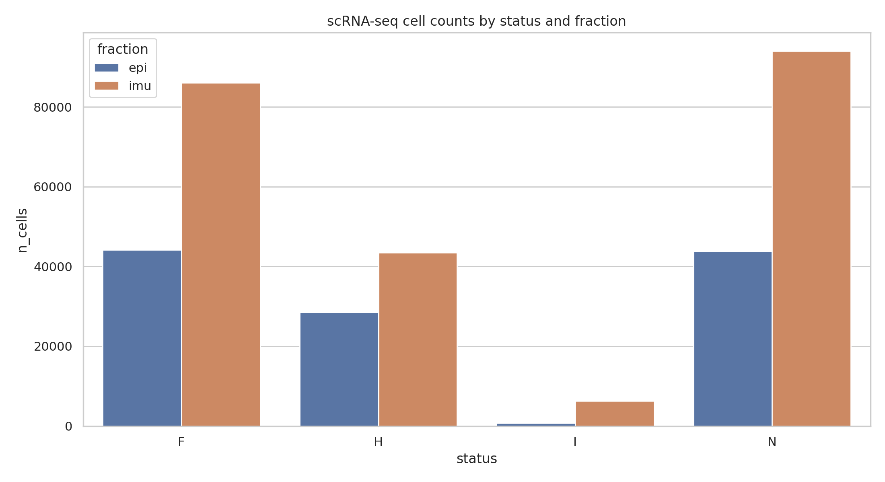

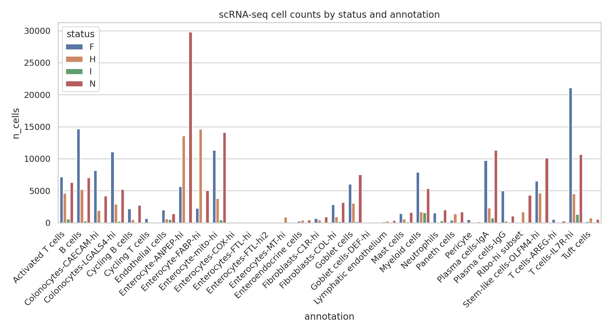

QC distributions were also generated:

- `output/baseline_overview/scrna/hist_total_counts.png`
- `output/baseline_overview/scrna/hist_pct_counts_mt.png`
- `output/baseline_overview/scrna/hist_doublet_score.png`

### Spatial Transcriptomics Summary

The spatial AnnData object contains 58,815 spots across 20 slides. Slide labels in the metadata are:

| Disease label | Slides |
|---|---:|
| Fibrotic | 10 |
| Adjacent | 8 |
| Adjacent (Disease Control) | 2 |

The slide metadata reports 58,815 total spots, matching the spatial AnnData object. The largest slides by spot count include `V10S15-055_A`, `V10A14-143_D`, `V10S15-054_A`, and `V11Y24-011_D`.

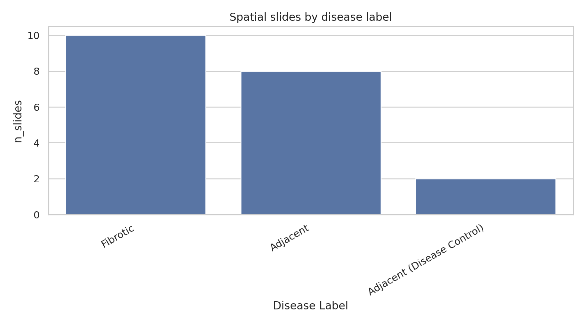

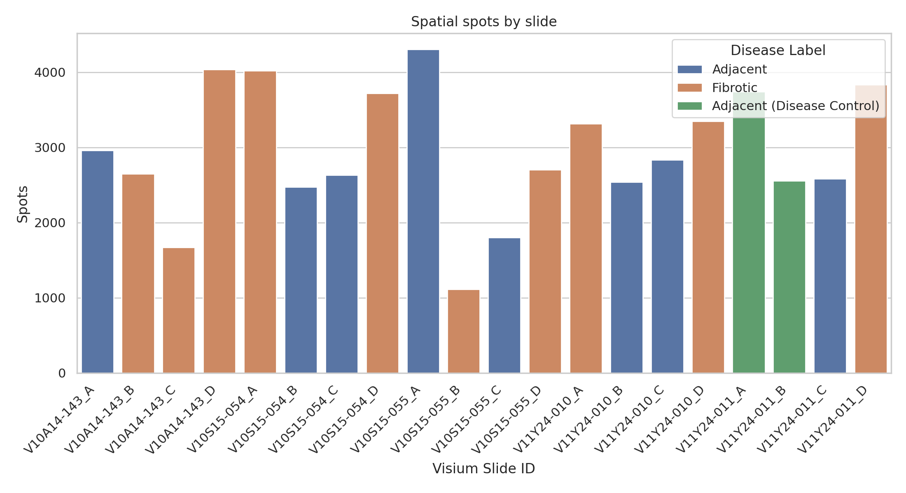

Detailed spatial outputs:

- `output/baseline_overview/spatial/spatial_slide_metadata.csv`
- `output/baseline_overview/spatial/spot_counts_by_sample.csv`
- `output/baseline_overview/spatial/spot_metadata.csv`

### Spatial QC

Spatial QC confirmed that all AnnData spot barcodes are present in the corresponding raw Visium archive position lists. Each raw archive contains 4,992 grid positions. The processed AnnData object contains the in-tissue subset for each slide.

| Metric | Value |
|---|---:|
| Slides checked | 20 |
| AnnData spots checked | 58,815 |
| AnnData barcodes missing from raw archives | 0 |
| Raw archive positions not present in AnnData | 41,025 |

The 41,025 raw archive positions not present in AnnData correspond to off-tissue or filtered positions. This is expected because the number of in-tissue positions in each archive matches the number of AnnData spots for that slide.

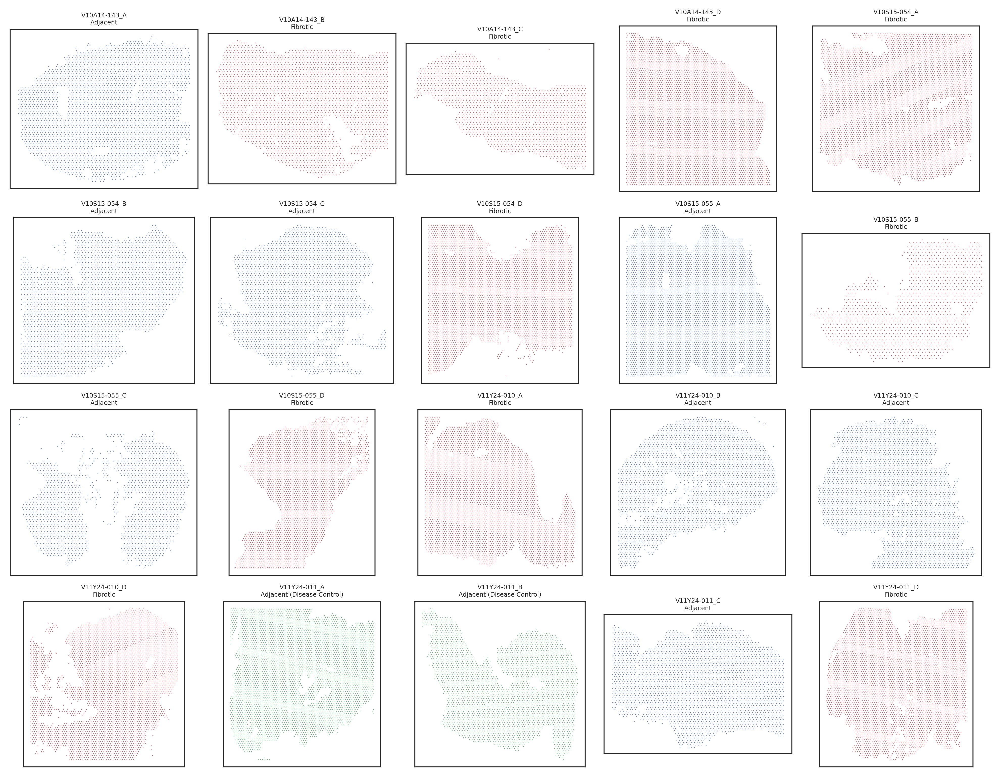

Representative low-resolution tissue-image overlays:

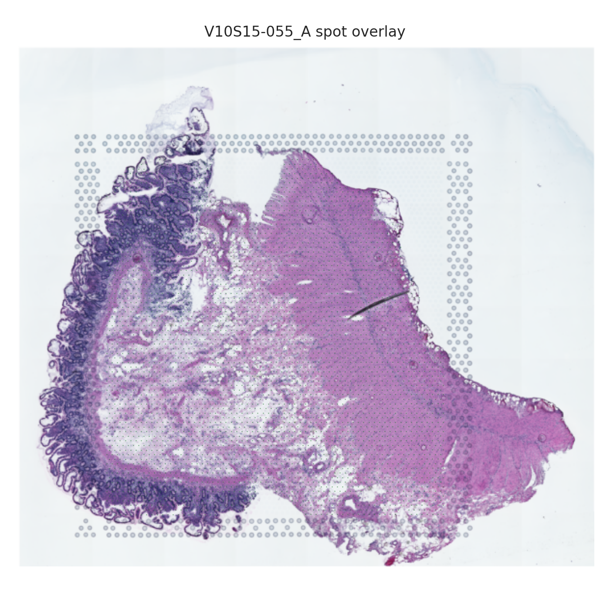

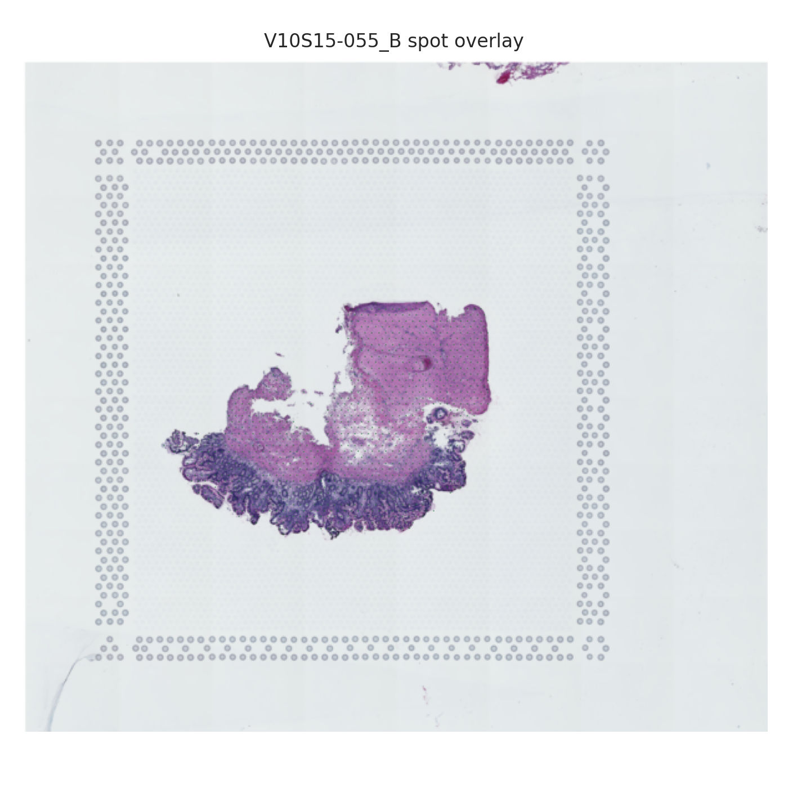

Detailed spatial QC outputs:

- `output/spatial_qc/spatial_qc_overview.json`
- `output/spatial_qc/spatial_qc_summary.csv`
- `output/spatial_qc/all_slides_coordinates.png`
- `output/spatial_qc/plots/`
- `output/spatial_qc/overlays/`

### Metabolism And Fibrosis Scores

Nine curated gene sets were scored across all 58,815 spatial spots:

- glycolysis;
- oxidative phosphorylation;
- hypoxia;
- retinoid/vitamin A biology;
- ECM remodeling;
- inflammation;
- epithelial repair;
- fatty acid metabolism;
- bile acid transport.

All requested genes were present in the spatial AnnData object for each gene set. Scores were summarized per slide and by disease label. At the disease-label level, fibrotic slides had the highest mean scores for inflammation and ECM remodeling among the tested programs. Adjacent slides had relatively higher mean bile-acid transport, epithelial repair, fatty-acid metabolism, oxidative phosphorylation, and glycolysis scores. These are exploratory summaries; spot-level observations are spatially structured and not independent.

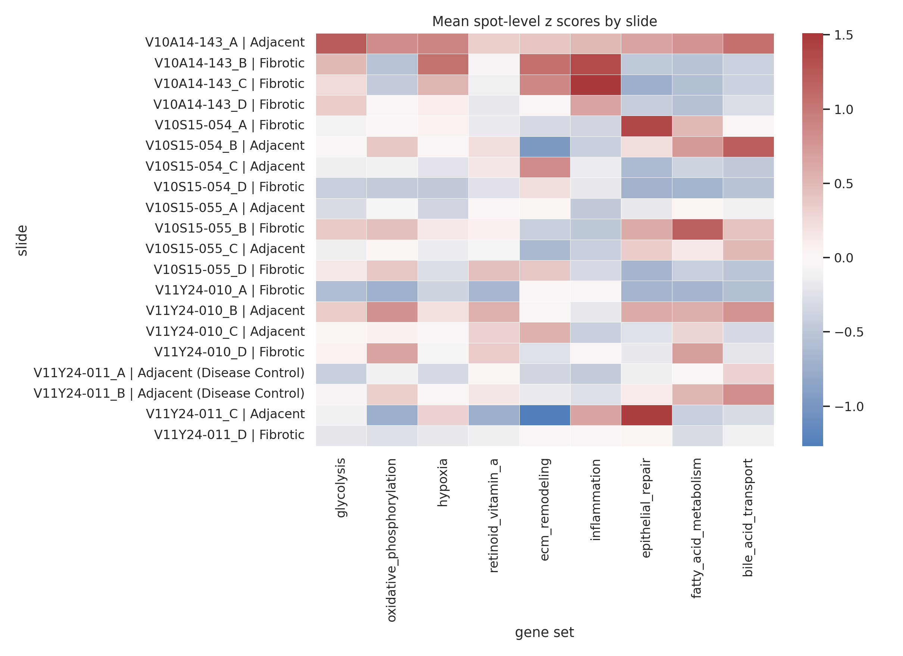

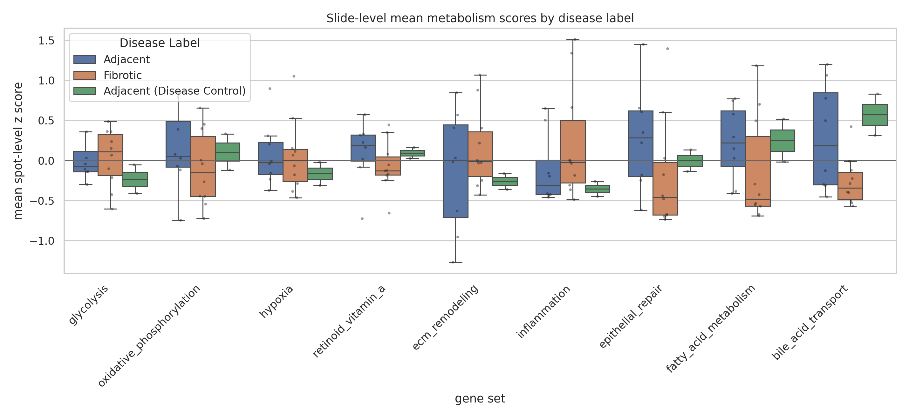

Representative all-slide spatial maps:


Paired adjacent-versus-fibrotic comparisons were available for 8 patients. Mean paired fibrotic-minus-adjacent differences were positive for ECM remodeling and inflammation, and negative for bile-acid transport, epithelial repair, fatty-acid metabolism, oxidative phosphorylation, glycolysis, retinoid/vitamin A, and hypoxia. These paired summaries are useful for prioritizing Harreman pilot slides, but should not yet be treated as formal differential testing.

Detailed metabolism outputs:

- `output/metabolism_scores/metabolism_scores_overview.json`
- `output/metabolism_scores/gene_set_membership.csv`
- `output/metabolism_scores/spot_metabolism_scores.parquet`
- `output/metabolism_scores/spot_metabolism_scores_selected.csv`
- `output/metabolism_scores/sample_metabolism_score_summary.csv`
- `output/metabolism_scores/disease_label_metabolism_score_summary.csv`
- `output/metabolism_scores/paired_patient_metabolism_score_differences.csv`
- `output/metabolism_scores/maps/`

### Harreman Pilot

The Harreman pilot was run on the paired adjacent and fibrotic slides from patient 110201:

| Slide | Disease label | General categorization | Spots |
|---|---|---|---:|
| `V10S15-054_B` | Adjacent | Normal | 2,472 |
| `V10S15-054_A` | Fibrotic | Chronic changes, early stricture | 4,019 |

The pilot used the human extracellular transporter database, a 6-nearest-neighbor spatial graph within each slide, expression filtering at a 1% spot threshold, and Harreman's parametric transporter communication test. The script uses CPU execution. A small compatibility workaround is included for a read-only NumPy/Pandas diagonal operation in Harreman's local-correlation matrix construction.

| Metric | Adjacent `V10S15-054_B` | Fibrotic `V10S15-054_A` |
|---|---:|---:|
| Transport metabolites after database/filtering | 216 | 211 |
| Transporter genes after filtering | 190 | 195 |
| Gene pairs tested | 935 | 993 |
| Spatial weight edges | 14,832 | 24,114 |
| Runtime, seconds | 39.4 | 44.0 |

There were 211 metabolites tested in both slides. The largest fibrotic-minus-adjacent z-score differences were observed for iron, fatty acid, L-leucine, choline, heme, zinc, folic acid, L-glutamine, L-serine, acetate, and several amino acids. The largest adjacent-shifted differences were observed for urea, propionate, beta-hydroxybutyrate, bile acid, lysophosphatidylcholine, glycyl-glycine, alpha-tocopherol, malate, fumarate, citrate, vitamin A, and butyrate.

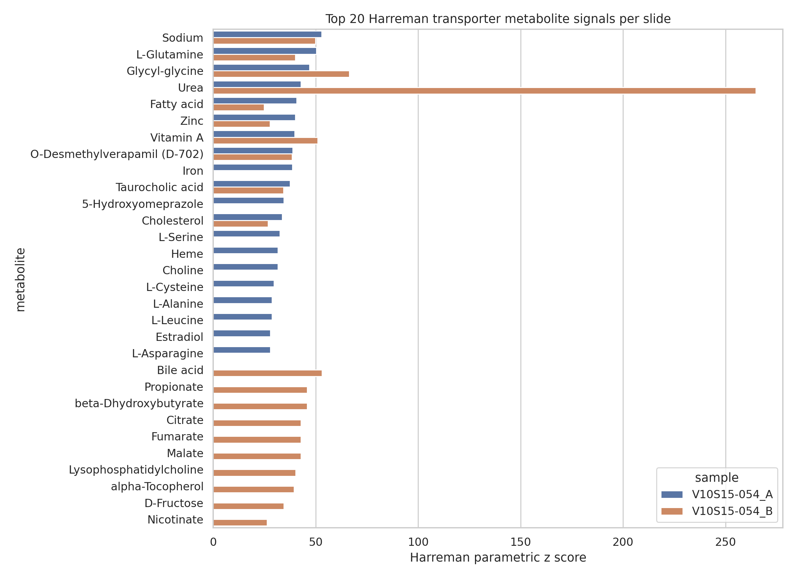

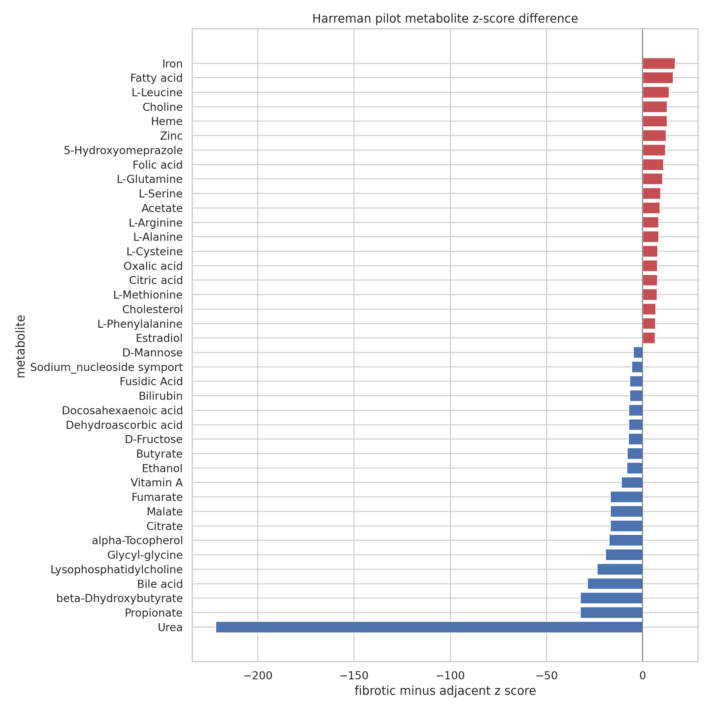

Detailed Harreman pilot outputs:

- `output/harreman_pilot/harreman_pilot_overview.json`
- `output/harreman_pilot/harreman_pilot_run_summary.csv`
- `output/harreman_pilot/harreman_metabolite_results.csv`
- `output/harreman_pilot/harreman_gene_pair_results.csv`
- `output/harreman_pilot/harreman_paired_metabolite_differences.csv`
- `output/harreman_pilot/top_metabolite_z_scores.png`
- `output/harreman_pilot/paired_metabolite_z_differences.png`

### Harreman Paired-Slide Scale-Up

The Harreman workflow was scaled to all patients with both adjacent and fibrotic spatial transcriptomics slides. This included 18 slides across 8 paired patients: 8 adjacent slides and 10 fibrotic slides.

The all-slide script reused the pilot settings: human extracellular transporter database, 6-nearest-neighbor spatial graph, 1% expression filtering, and Harreman's parametric transporter communication test. Per-slide results are cached under `output/harreman_all_slides/per_sample/`.

| Metric | Value |
|---|---:|
| Slides analyzed | 18 |
| Paired patients | 8 |
| Adjacent slides | 8 |
| Fibrotic slides | 10 |
| Metabolites with paired results | 215 |
| Mean per-slide runtime, seconds | 41.6 |
| Total per-slide runtime, seconds | 748.5 |

Across paired patients, the largest mean fibrotic-minus-adjacent z-score differences were observed for L-histidine, L-serine, citric acid, oxalic acid, D-maltose, D-xylose, L-cysteine, L-asparagine, L-alanine, L-methionine, and L-leucine. Several of these were positive in at least 6 of 8 paired patients.

The strongest mean adjacent-shifted differences included urea, propionate, beta-hydroxybutyrate, adenosylcobalamin, sodium, taurocholic acid, L-dopa, bile acid, cholic acid, cholesterol, fatty acid, D-fructose, and hyodeoxycholic acid. Some of these were present in fewer paired patients, so `n_patients` and patient-level consistency should be considered alongside the mean difference.

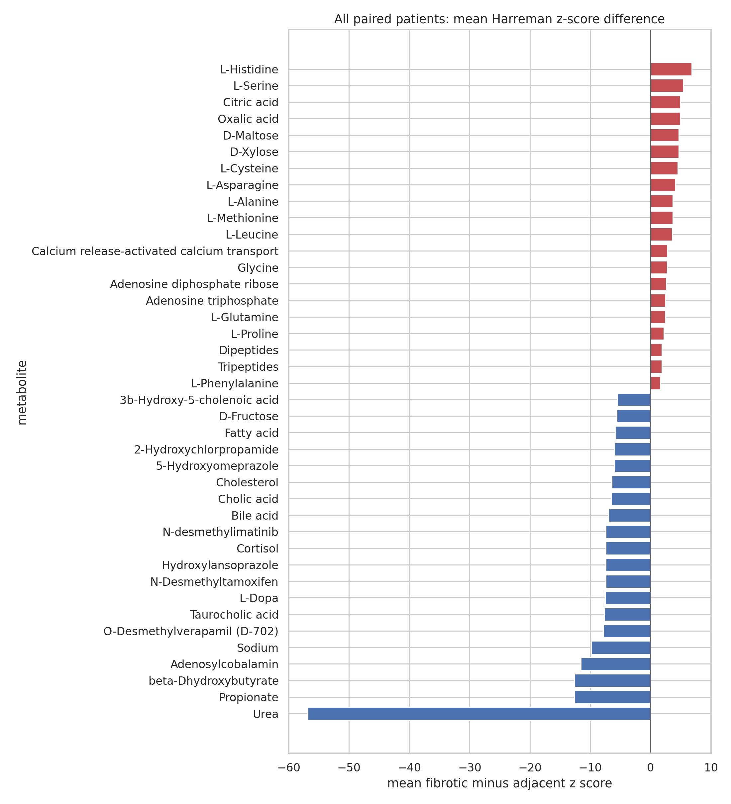

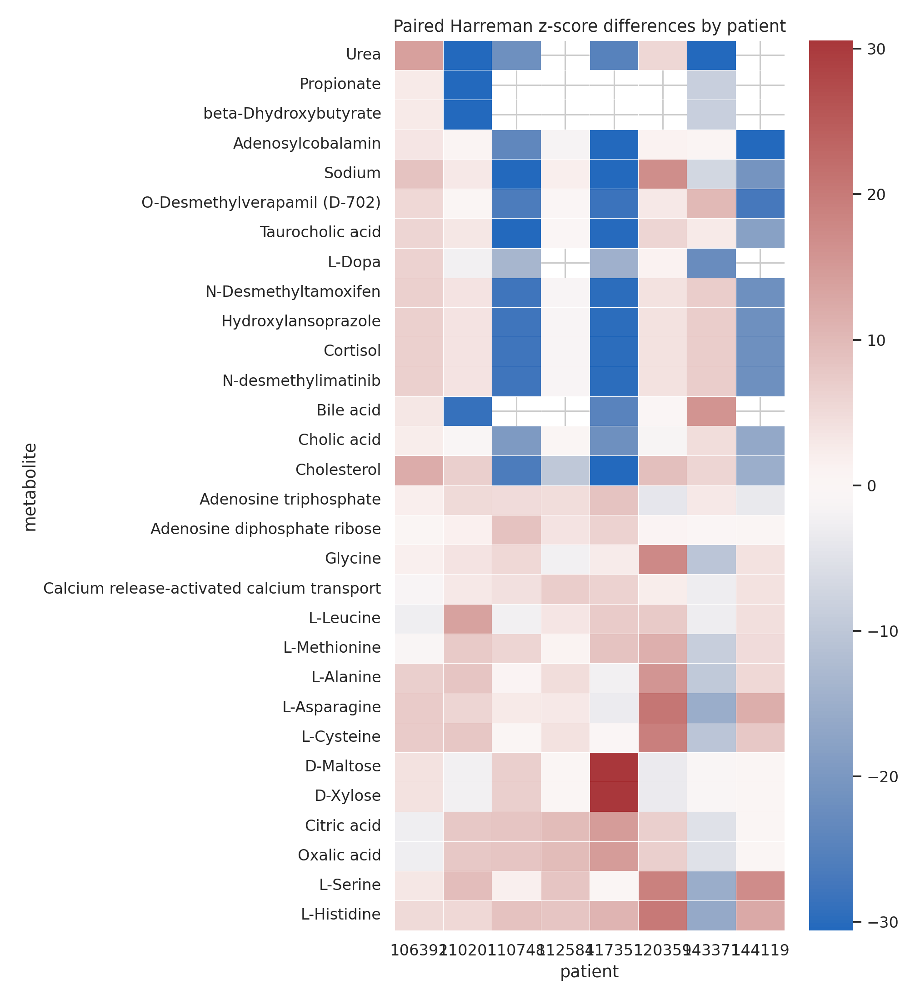

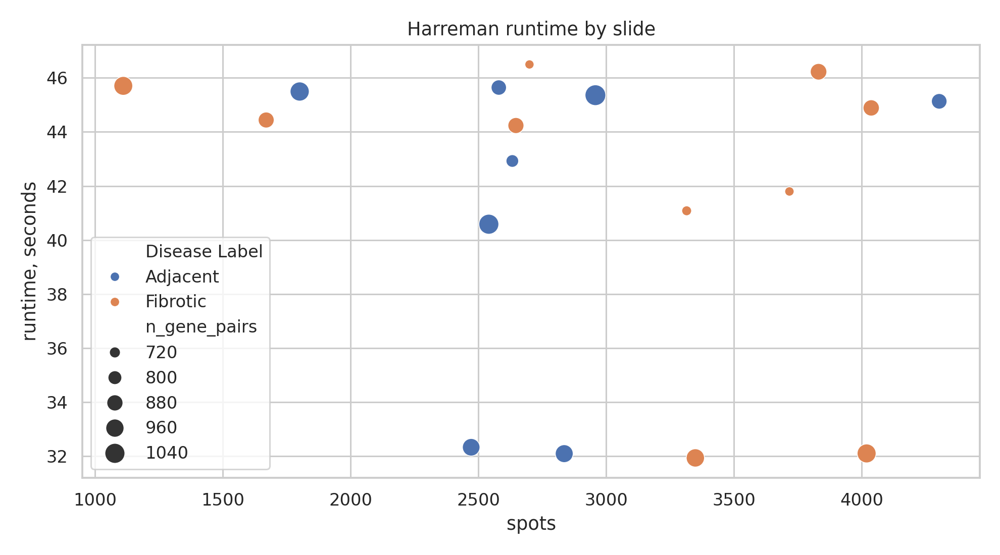

Detailed all-slide Harreman outputs:

- `output/harreman_all_slides/harreman_all_slides_overview.json`
- `output/harreman_all_slides/harreman_all_run_summary.csv`
- `output/harreman_all_slides/harreman_all_metabolite_results.csv`
- `output/harreman_all_slides/harreman_all_gene_pair_results.csv`
- `output/harreman_all_slides/harreman_patient_paired_metabolite_differences.csv`
- `output/harreman_all_slides/harreman_metabolite_difference_summary.csv`
- `output/harreman_all_slides/mean_paired_metabolite_differences.png`
- `output/harreman_all_slides/paired_difference_heatmap.png`
- `output/harreman_all_slides/harreman_runtime_by_slide.png`
- `output/harreman_all_slides/per_sample/`

### Spatial Deconvolution

The provided CIBERSORTx Gut Atlas IBD signature matrix was used as a direct reference for first-pass Visium spot deconvolution. The matrix contains 42 cell types. Of 7,458 signature genes, 7,350 overlapped the spatial AnnData gene symbols. The initial NNLS model used the 2,000 shared genes with the highest variance across signature cell types.

| Metric | Value |
|---|---:|
| Spots deconvolved | 58,815 |
| Signature cell types | 42 |
| Signature genes | 7,458 |
| Signature genes overlapping spatial data | 7,350 |
| Selected genes used in NNLS | 2,000 |
| Median relative residual | 0.821 |
| Mean relative residual | 0.825 |

The high residual indicates that this transparent NNLS deconvolution is useful as an initial composition estimate, but should be interpreted cautiously. Potential reasons include platform differences between the CIBERSORTx scRNA-seq reference and Visium profiles, broad spot mixtures, scale differences between signature values and spatial expression values, and the use of a deliberately simple constrained regression model.

Mean paired fibrotic-minus-adjacent differences suggested higher B/plasma signal in fibrotic slides and lower absorptive, secretory, myofibroblast, smooth muscle, fibroblast, lymphatic endothelial, microfold, vascular endothelial, and pericyte signals on average. Some of these directions are biologically plausible, while others need scrutiny against histology, marker expression, and fit diagnostics before interpretation.

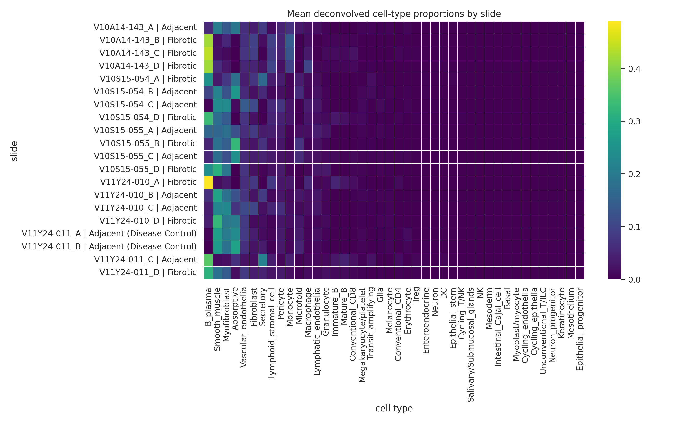

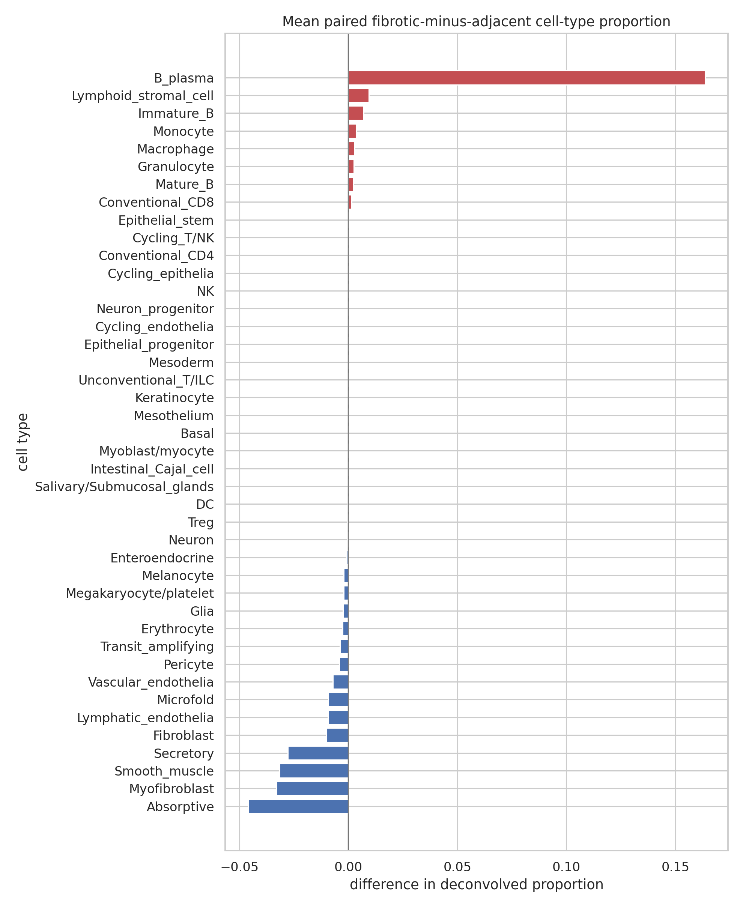

Representative spatial deconvolution maps:

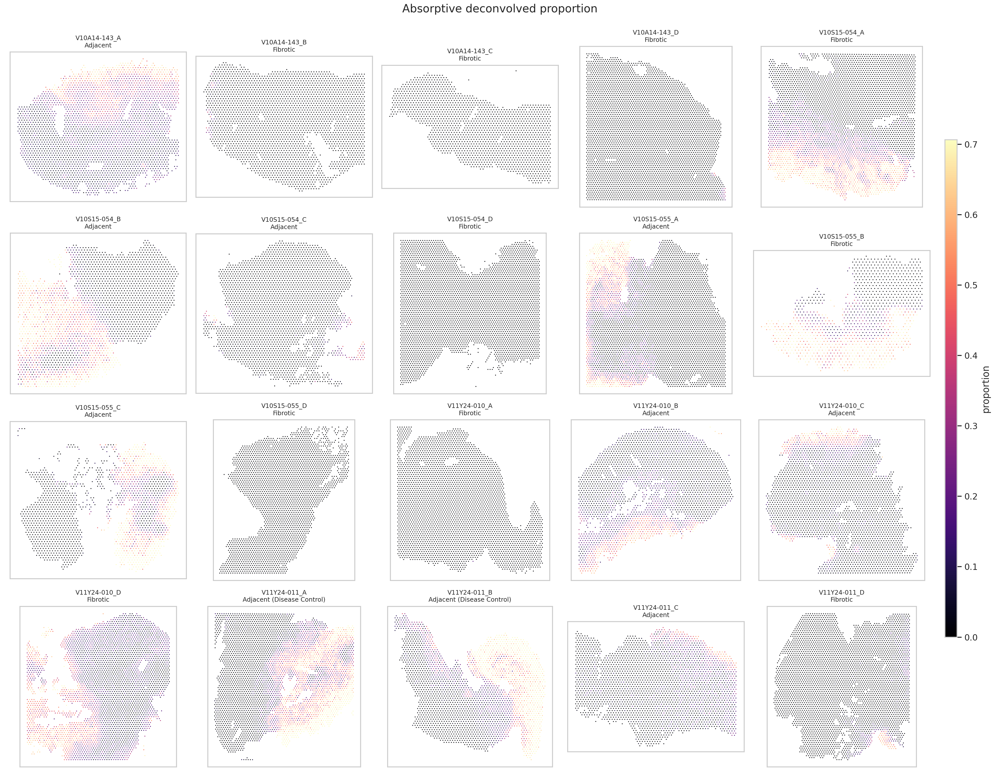


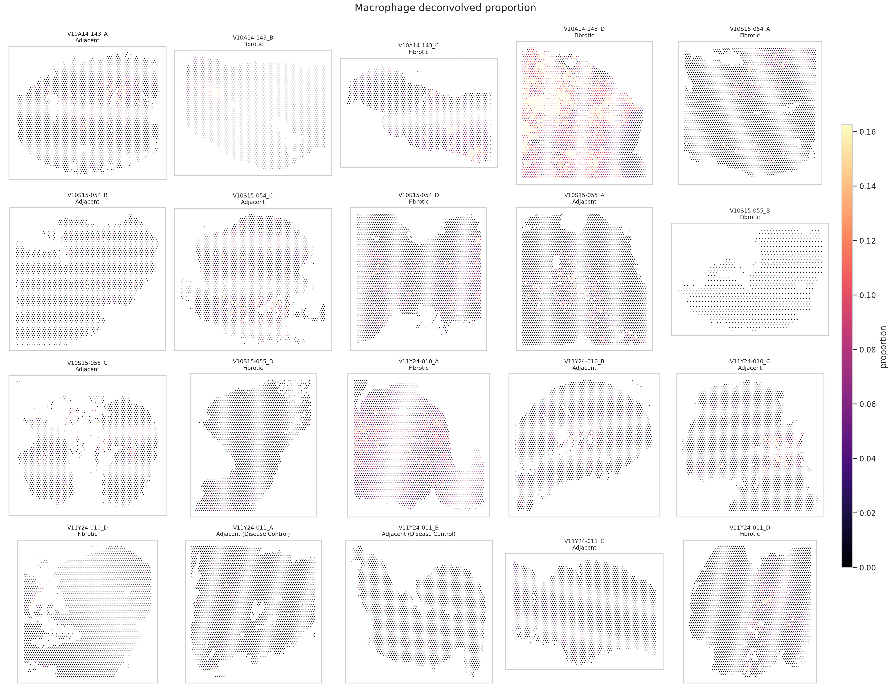

Detailed deconvolution outputs:

- `output/spatial_deconvolution/spatial_deconvolution_overview.json`
- `output/spatial_deconvolution/deconvolution_fit_summary.csv`
- `output/spatial_deconvolution/signature_gene_overlap_summary.csv`
- `output/spatial_deconvolution/selected_signature_genes.csv`
- `output/spatial_deconvolution/spot_cell_type_proportions.parquet`
- `output/spatial_deconvolution/spot_cell_type_proportions_selected.csv`
- `output/spatial_deconvolution/sample_cell_type_proportion_summary.csv`
- `output/spatial_deconvolution/disease_label_cell_type_proportion_summary.csv`
- `output/spatial_deconvolution/paired_patient_cell_type_differences.csv`
- `output/spatial_deconvolution/paired_cell_type_difference_summary.csv`
- `output/spatial_deconvolution/maps/`

### Harreman And Cell-Type Interpretation

Harreman results were compared against the CIBERSORTx signature-matrix deconvolution and marker-gene summaries. The analysis focused on 14 metabolites prioritized from the all-slide Harreman results, including amino acid and epithelial-associated signals.

Marker validation supported several major deconvolved signatures:

| Marker set | Deconvolved cell type | Spearman rho across slides |
|---|---|---:|
| B/plasma markers | `B_plasma` | 0.980 |
| Absorptive markers | `Absorptive` | 0.929 |
| Macrophage markers | `Macrophage` | 0.780 |
| Fibroblast markers | `Fibroblast` | 0.761 |
| Myofibroblast markers | `Myofibroblast` | 0.514 |

Across slides, bile-acid and cholic-acid Harreman z-scores were strongly correlated with absorptive and microfold deconvolution estimates. Urea also tracked absorptive and microfold estimates. This supports the interpretation that several adjacent-shifted bile-acid and related transport signals are epithelial-associated rather than broadly stromal.

Examples of strong slide-level correlations:

| Metabolite | Cell type | Spearman rho | Slides |
|---|---|---:|---:|
| Bile acid | Microfold | 0.934 | 14 |
| Urea | Absorptive | 0.915 | 16 |
| Urea | Microfold | 0.914 | 16 |
| Bile acid | Absorptive | 0.912 | 14 |
| Cholic acid | Microfold | 0.873 | 18 |
| Cholic acid | Absorptive | 0.866 | 18 |

Paired patient-level differences showed similar epithelial associations for bile acid and cholic acid, but these correlations should be interpreted cautiously because the paired sample size is small.

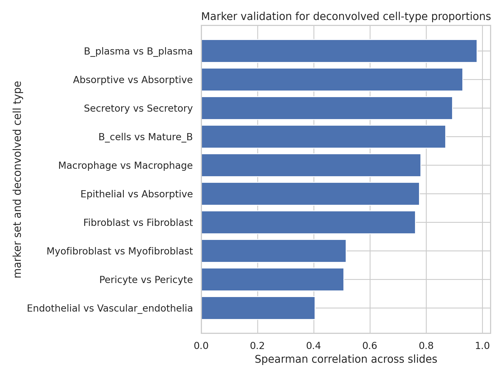

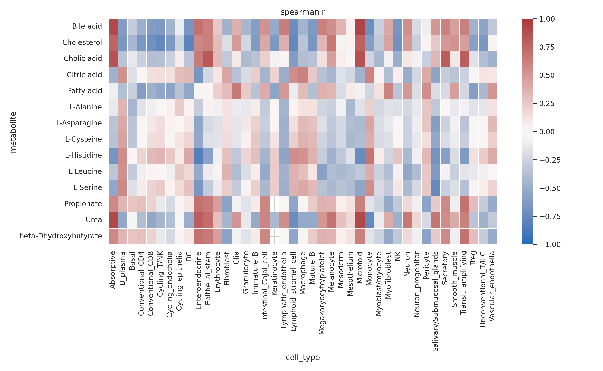

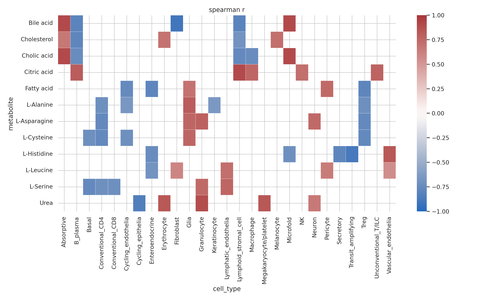

Detailed interpretation outputs:

- `output/harreman_deconv_interpretation/harreman_deconv_interpretation_overview.json`
- `output/harreman_deconv_interpretation/slide_level_harreman_deconv_correlations.csv`
- `output/harreman_deconv_interpretation/paired_difference_harreman_deconv_correlations.csv`
- `output/harreman_deconv_interpretation/top_metabolite_gene_pair_evidence.csv`
- `output/harreman_deconv_interpretation/marker_scores_by_slide.csv`
- `output/harreman_deconv_interpretation/marker_deconvolution_correlations.csv`
- `output/harreman_deconv_interpretation/marker_deconvolution_validation.png`
- `output/harreman_deconv_interpretation/slide_level_harreman_deconv_correlation_heatmap.png`
- `output/harreman_deconv_interpretation/paired_difference_top_correlation_heatmap.png`

## Next Analyses

The next step is interpretation and refinement rather than another broad method run. Priority analyses are:

- inspect whether high-ranking Harreman metabolites are driven by broad expression, tissue area, or a small set of transporter genes;
- connect metabolite differences back to transporter gene pairs and spatial regions;
- compare Harreman results with the simpler gene-set scores;
- compare Harreman results with the CIBERSORTx signature-matrix deconvolution;
- refine deconvolution using marker-gene diagnostics, alternative gene selection, or a heavier method if needed;
- run focused visualizations for the most plausible fibrosis, epithelial, stromal, and bile-acid-related signals.

The immediate next refinement should focus on transporter gene-pair inspection for the strongest epithelial-associated and fibrotic-associated metabolites. In particular, bile acid, cholic acid, urea, L-histidine, L-serine, citric acid, and L-cysteine should be traced back to the transporter genes and spatial expression maps that drive the Harreman scores.

## Limitations

Current results include inventory, metadata-level summaries, spatial coordinate/image QC, exploratory metabolism/fibrosis gene-set scores, one Harreman pilot, an all-paired-slide Harreman transporter communication run, first-pass CIBERSORTx signature-matrix deconvolution, and an initial Harreman-cell-type interpretation layer. No cell-type-aware Harreman model or formal statistical model of patient-paired differences has been generated yet. The current Harreman and deconvolution results should be treated as prioritization and hypothesis-generation output rather than final biological conclusions.

## Conclusion

The project now has a reproducible Python environment, data inventory scripts, baseline scRNA-seq and spatial metadata summaries, spatial QC overlays, exploratory metabolism/fibrosis gene-set scores, a Harreman pilot, an all-paired-slide Harreman run, first-pass CIBERSORTx signature-matrix deconvolution, an initial cell-type interpretation layer, and a Quarto report that records methods, progress, output-backed results, and references. The next analysis step is focused transporter-gene and spatial-region validation for the strongest Harreman signals.

## References {.unnumbered}

::: {#refs}
:::
